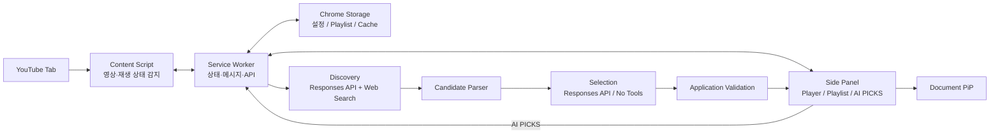

# Pixel Jukebox

> YouTube에서 재생 중인 음악을 LP/CD 형태로 시각화하고 Playlist를 관리하며, 사용자가 선택적으로 OpenAI를 연결하면 현재 음악과 Playlist 문맥을 기반으로 비슷한 음악을 발견할 수 있는 Chrome Extension

## 1. 프로젝트 개요

Pixel Jukebox는 Chrome Desktop 환경에서 YouTube 음악 감상 경험을 확장하는 Manifest V3 기반 Extension이다.

기본 기능은 AI 없이 동작한다.

- 현재 YouTube 영상 및 재생 상태 감지
- LP/CD 회전 Player
- Playlist 추가·삭제·순서 변경
- 이전·다음 Track 및 반복 재생
- 색상과 Disc Style 설정
- PNG/GIF 저장
- Document Picture-in-Picture
- 설정 및 Playlist 저장

`AI PICKS`는 사용자가 직접 활성화하는 선택 기능이다.

사용자가 자신의 OpenAI API Key를 연결한 경우에만 현재 Track, Playlist, 최근 추천 기록을 기준으로 비슷한 음악을 탐색·선별한다.

구체적인 UI와 픽셀 디자인 기준은 `DESIGN.md`, 작업 규칙과 문서 우선순위는 `AGENT.md`를 따른다.

---

## 2. 프로젝트 목표

### Core Player

```text
YouTube 음악 재생
        ↓
현재 Track 감지
        ↓
Side Panel
        ↓
LP / CD Player
        ↓
Playlist · Design · Export · PiP
```

OpenAI 연결 없이 모든 Core Player 기능 사용 가능.

### AI PICKS

```text
현재 Track
+
Playlist
+
최근 추천 기록
        ↓
Discovery
        ↓
Candidate Set
        ↓
Selection
        ↓
Application Validation
        ↓
AI PICKS
```

AI 실행은 사용자 요청 시에만 발생한다.

---

## 3. 범위

### 포함

| 영역 | 기능 |
|---|---|
| Extension | Manifest V3, Side Panel, Service Worker, Content Script |
| YouTube | 현재 영상·재생 상태 감지, SPA 전환 대응 |
| Player | LP/CD 회전, Play/Pause, Previous/Next |
| Playlist | 추가·삭제·순서 변경·반복 재생·상태 복구 |
| Design | 색상, LP/CD Style |
| Export | PNG, GIF |
| PiP | Document Picture-in-Picture, 기본 Controller |
| Storage | Playlist, 설정, Cache 저장 |
| AI | 사용자 OpenAI API Key 연결 |
| AI PICKS | Discovery, Candidate Parser, Selection, Validation |
| AI PICKS | 추천 최대 5곡, 이유, Tag, YouTube 검색 연결 |
| 안정성 | AI 오류와 Core Player 오류 격리 |

### 제외

| 영역 | 기능 |
|---|---|
| Account | 자체 회원가입·로그인 |
| Backend | OpenAI Proxy Server |
| AI | Multi-Agent |
| AI | Vector DB |
| AI | 자체 Recommendation Model |
| AI | Playlist 자동 변경 |
| AI | 추천곡 자동 재생 |
| YouTube | AI의 Video ID·URL 임의 생성 |
| Media | 음악 파일 다운로드·자체 스트리밍 |
| Browser | Firefox·Safari·모바일 지원 |
| Distribution | 일반 사용자 대상 Chrome Web Store 운영 |

---

## 4. 전체 구조



---

## 5. 기술 구성

| 영역 | 기술 |
|---|---|
| Extension | Chrome Extension Manifest V3 |
| 최소 Chrome | Chrome 140 |
| Language | TypeScript |
| UI | HTML / CSS / TypeScript |
| Build | Vite |
| Main UI | Chrome Side Panel |
| Background | Extension Service Worker |
| YouTube 연동 | Content Script |
| Messaging | `chrome.runtime` |
| 영속 저장 | `chrome.storage.local` |
| Session 저장 | `chrome.storage.session` |
| PiP | Document Picture-in-Picture |
| AI | OpenAI Responses API |
| AI 탐색 | OpenAI Web Search |
| AI 최종 출력 | Structured Outputs / JSON Schema |
| Test | Vitest |

UI Framework는 초기 범위에 포함하지 않는다.

Vanilla TypeScript로 진행하고 실제 복잡도가 확인된 경우에만 별도 검토한다.

---

## 6. 핵심 설계 결정

### Chrome 최소 버전

프로젝트 최소 지원 버전은 Chrome 140으로 고정한다.

```json
{
  "minimum_chrome_version": "140"
}
```

Chrome 140을 특정 API의 최초 지원 버전으로 정의하지 않는다.

Side Panel, Document PiP, Storage 접근 정책을 포함한 프로젝트 기준 버전으로 사용하고 실제 동작은 해당 Phase에서 검증한다.

### YouTube 상태

재생 식별자는 `videoId` 기준으로 관리한다.

여러 YouTube Tab이 열려 있는 경우 `tabId` 기준으로 상태를 분리한다.

YouTube SPA 전환 감지 방식과 DOM Selector는 Phase 1에서 실제 YouTube 구조를 확인한 뒤 결정한다.

### AI Opt-in

OpenAI API 호출은 `AI PICKS` 실행 또는 `REFRESH PICKS`에서만 발생한다.

Track 변경, Play/Pause, Playlist 편집, PiP, Export, Cache Hit에서는 OpenAI 요청을 발생시키지 않는다.

### AI 장애 격리

OpenAI 인증 오류, Rate Limit, 응답 파싱 실패, 추천 실패는 Core Player 동작에 영향을 주지 않는다.

### 공개 배포

현재 BYOK 구조는 개인 개발·학습·포트폴리오 범위로 한정한다.

일반 사용자 대상 공개 서비스 전환 시 Backend Proxy, 인증, Secret 관리, Rate Limit, Abuse 방지, 비용 정책을 별도 기획한다.

---

## 7. Core Player

### YouTube 연동

수집 대상:

```text
videoId
videoTitle
channelTitle
thumbnail
videoUrl
playbackState
```

`channelTitle`을 Artist라고 단정하지 않는다.

### Playlist

지원 기능:

- 현재 YouTube 영상 추가
- Track 삭제
- Drag & Drop 순서 변경
- Previous / Next
- Play / Pause
- 마지막 Track 이후 Track 1 반복
- Chrome 재실행 후 Playlist 복구

### Design

지원 범위:

- LP / CD
- Album Artwork
- 재생 상태 연동 Rotation
- Background / Panel / Accent / Text Color
- Disc Style

세부 색상, Pixel Grid, Component, 상태 UI는 `DESIGN.md`를 따른다.

### Export

- PNG
- GIF
- 현재 Player 디자인 반영

실행 코드는 Extension Package 내부에 포함한다.

Thumbnail과 Canvas Export 호환성은 Phase 2에서 실측한다.

### Document PiP

지원 범위:

- Disc
- Rotation
- Track 정보
- Previous
- Play / Pause
- Next

PiP 지원 여부는 런타임에서 확인한다.

```ts
'documentPictureInPicture' in window
```

PiP 실행 실패는 Side Panel Player로 전파하지 않는다.

---

## 8. Storage 및 OpenAI Key

### 일반 데이터

`chrome.storage.local` 사용:

```text
settings
playlist
recommendationCache
recentRecommendations
aiPreferences
```

### API Key 기본 저장

`chrome.storage.session` 사용:

```text
openaiApiKey
```

기본 정책은 브라우저 세션 단위 저장이다.

### API Key 영속 저장

사용자가 명시적으로 선택한 경우에만 `storage.local` 저장을 시도한다.

```text
영속 저장 선택
        ↓
setAccessLevel(TRUSTED_CONTEXTS)
        ↓
성공 ──→ storage.local 저장
        ↓
실패 ──→ Local 저장 금지
          storage.session 유지
```

실제 `TRUSTED_CONTEXTS` 차단 동작은 Phase 3에서 직접 검증한다.

### Key 취급 기준

- Source Code 포함 금지
- Git Commit 금지
- `storage.sync` 저장 금지
- Console 출력 금지
- 오류 로그 출력 금지
- Content Script 전달 금지
- DOM 삽입 금지
- Runtime Message Payload 포함 금지
- Authorization Header 로그 금지
- AI 연결 해제 시 저장 Key 제거

OpenAI 요청은 Service Worker에서만 수행한다.

### 데이터 전송 고지

AI PICKS 활성화 시 현재 Track 정보, Playlist의 곡 정보, 최근 추천 기록이 OpenAI API 요청에 포함됨을 사용자에게 표시한다.

AI 미사용 상태에서는 해당 데이터를 OpenAI로 전송하지 않는다.

---

## 9. AI PICKS

### 실행 흐름

```text
Current Track
+
Playlist
+
Recent Recommendations
        ↓
1. Discovery
        ↓
2. Candidate Parser
        ↓
3. Selection
        ↓
4. Application Validation
        ↓
AI PICKS
```

하나의 Recommendation Workflow로 구성하며 Multi-Agent를 사용하지 않는다.

### Discovery

목적:

- 현재 Track을 가장 강한 추천 신호로 사용
- Playlist를 보조 문맥으로 반영
- 최근 추천 및 명백한 중복 제외
- Web Search 기반 음악 후보 탐색
- 최대 10개 Candidate 생성

Discovery에서는 Strict Structured Output을 사용하지 않는다.

출력은 고정 Line Format을 사용한다.

```text
CANDIDATE|C01|Artist|Track
CANDIDATE|C02|Artist|Track
```

Prompt 전문은 Phase 4에서 실제 API 결과를 기준으로 확정한다.

### Candidate Parser

애플리케이션에서 검증:

- Line Format
- Candidate ID
- Artist / Track 필수값
- Candidate ID 중복
- Artist + Track 중복
- 현재 Track과 명백한 중복
- Playlist와 명백한 중복
- 최근 추천과 명백한 중복

파싱할 수 없는 Line은 폐기한다.

### Candidate Set

```ts
interface CandidateTrack {
  candidateId: string;
  artist: string;
  title: string;
}
```

`Verified Candidate Set`이라는 표현은 사용하지 않는다.

Web Search를 거쳤더라도 외부 음악 데이터베이스 식별자를 이용해 존재를 100% 검증하는 구조는 아니기 때문이다.

### Selection

Selection에는 Web Search를 제공하지 않는다.

Candidate Set 안에서 최대 5개를 선택하고 Structured Output으로 반환한다.

```json
{
  "recommendations": [
    {
      "candidateId": "C01",
      "reason": "현재 곡의 몽환적인 기타 질감과 유사",
      "tags": ["dreamy", "indie"]
    }
  ]
}
```

Artist와 Track은 모델이 다시 생성하지 않는다.

`candidateId`를 기준으로 Candidate Set 원본과 결합한다.

YouTube 검색 문자열도 애플리케이션 코드에서 생성한다.

### Application Validation

검증 기준:

- JSON Parse
- JSON Schema
- 최대 5개
- Candidate ID 존재
- Candidate ID 중복 없음
- Candidate Set 외 ID 없음
- Reason 존재
- Tag 1~3개

Candidate Set 외 결과는 UI에 표시하지 않는다.

### Structured Output 실패

Selection 실패 시 동일 Candidate Set으로 1회 재시도한다.

1회 Retry는 검증된 최적값이 아닌 프로젝트 초기값이다.

Retry 시 Discovery를 다시 실행하지 않는다.

Partial JSON은 자동 복구하지 않는다.

### Cache

Cache Key:

```text
currentTrack.videoId
+
playlistFingerprint
```

Cache Hit에서는 OpenAI API를 호출하지 않는다.

`REFRESH PICKS`는 Cache를 우회하고 기존 추천을 `recentRecommendations`에 반영한 뒤 Discovery를 다시 실행한다.

---

## 10. OpenAI 모델 정책

모델명은 단일 설정에서 관리한다.

구체적인 모델은 Phase 4 구현 직전 OpenAI 공식 문서를 확인한 뒤 고정한다.

선정 기준:

- Responses API 지원
- Web Search 지원
- Structured Outputs 지원
- 비용
- 응답 시간
- 실제 추천 품질

현재 기획 단계에서 특정 모델명을 확정하지 않는다.

---

## 11. Phase 0 — Extension 기반 구성

### 목표

Manifest V3 기반 최소 Extension 실행 구조 검증.

### 범위

- Manifest V3
- `minimum_chrome_version: "140"`
- Vite / TypeScript Build
- Service Worker
- Content Script
- Side Panel
- Runtime Messaging
- YouTube 대상 실행
- 최소 Permission

### 제외

- Player
- Playlist
- Export
- PiP
- OpenAI
- AI PICKS

### 완료 기준

- [ ] Extension Build 및 Developer Mode 로드 성공
- [ ] YouTube Content Script 실행
- [ ] Side Panel 실행
- [ ] Content Script ↔ Service Worker ↔ Side Panel 통신 확인
- [ ] 사용하지 않는 Permission 없음

---

## 12. Phase 1 — YouTube Player

### 목표

YouTube 재생 상태와 Side Panel Player 연결.

### 범위

- Video ID / Title / Channel / Thumbnail
- Play / Pause 상태
- SPA 영상 변경 감지
- LP/CD Disc
- Rotation
- 기본 Controller
- 여러 YouTube Tab 상태 분리

### 제외

- Playlist 관리
- Export
- PiP
- AI

### 완료 기준

- [ ] 최초 영상 및 SPA 전환 감지
- [ ] Side Panel Track 상태 갱신
- [ ] 재생 상태와 Disc Rotation 동기화
- [ ] 기본 Controller 동작
- [ ] 여러 YouTube Tab 상태 혼선 없음

---

## 13. Phase 2 — Playlist · Design · Export · PiP

### 목표

AI 없이 사용할 수 있는 Core Player 기능 완성.

### 범위

- Playlist 추가·삭제·순서 변경
- Previous / Next / 반복 재생
- Playlist 및 Design 저장·복구
- LP/CD 및 색상 설정
- PNG / GIF
- Document PiP
- PiP Controller

### 제외

- OpenAI
- AI PICKS

### 완료 기준

- [x] 여러 Track Playlist 관리 및 반복 재생
- [x] Chrome 재실행 후 Playlist·Design 복구
- [x] PNG / GIF 생성
- [x] Side Panel에서 Document PiP 실제 실행
- [x] PiP Controller 동작 및 오류 격리

---

## 14. Phase 3 — OpenAI 연결

### 목표

AI PICKS 사용자를 위한 선택적 OpenAI 연결 구성.

### 범위

- OpenAI Optional Host Permission
- API Key 입력·제거
- 기본 `storage.session`
- 선택적 `storage.local`
- `TRUSTED_CONTEXTS`
- Service Worker 전용 OpenAI 요청 경로
- Key 노출 방지

### 제외

- 음악 추천
- Web Search
- Discovery
- Selection

### 완료 기준

- [x] AI 미사용 시 OpenAI Permission 및 API 요청 없음
- [x] Session Key 저장·재시작 제거 확인
- [x] `storage.local.setAccessLevel(TRUSTED_CONTEXTS)` 실제 동작 확인
- [x] Service Worker 조회 성공 / Content Script 조회 차단 확인
- [x] 접근 제한 실패 시 Local 저장 차단
- [x] Console·로그·Runtime Message에 Key 노출 없음

---

## 15. Phase 4 — AI Recommendation

### 목표

현재 Track과 Playlist 기반 AI PICKS 구현.

### 범위

- Discovery + Web Search
- Candidate Parser
- Candidate Set
- Selection + Structured Output
- Candidate ID Whitelist
- 추천 최대 5곡
- 한국어 Reason
- Music Tag
- YouTube 검색 연결
- Selection 1회 Retry
- Partial JSON 폐기

### 제외

- Multi-Agent
- Vector DB
- 자체 Recommendation Model
- Playlist 자동 변경
- 자동 Video ID 선택

### 완료 기준

- [ ] Discovery와 Selection 요청 분리 확인
- [ ] Candidate Set 생성 및 Whitelist 검증
- [ ] Structured Output Schema 검증
- [ ] Candidate Set 외 결과 차단
- [ ] 최대 5개 추천 및 YouTube 검색 연결
- [ ] Selection Retry 시 Discovery 재실행 없음
- [ ] AI 실패 시 Core Player 정상 유지

---

## 16. Phase 5 — Cache · 안정성 검증

### 목표

OpenAI 호출 비용과 AI 실패 처리, Extension 안정성 검증.

### 범위

- Cache Hit / Miss
- Playlist Fingerprint
- REFRESH PICKS
- Recent Recommendations
- Discovery / Selection 실패
- 인증 / Rate Limit / 사용량 오류
- Permission 및 Key 노출 검토
- Remote Hosted Code 검토

### 완료 기준

- [ ] Cache Hit 시 OpenAI 요청 0건
- [ ] REFRESH PICKS Cache 우회
- [ ] Selection 실패 시 Web Search 재호출 없음
- [ ] Retry 재실패 UI 처리
- [ ] Partial JSON 자동 복구 없음
- [ ] AI 비활성 상태 OpenAI 요청 0건
- [ ] 불필요한 Permission 및 Remote Hosted Code 없음

---

## 17. 전체 완료 기준

### Extension

- [ ] Manifest V3
- [ ] Chrome 140 이상
- [ ] Side Panel
- [ ] 최소 Permission

### Core Player

- [ ] YouTube 영상·재생 상태 감지
- [ ] LP/CD Rotation
- [ ] Playlist 추가·삭제·순서 변경·반복
- [ ] Design 저장·복구
- [ ] PNG / GIF
- [ ] Document PiP 및 Controller

### OpenAI

- [ ] AI 완전 Opt-in
- [ ] Session Key 기본 저장
- [ ] 선택적 Local Key
- [ ] Local 접근 제한 실측
- [ ] API Key 노출 방지
- [ ] AI 미사용 시 OpenAI 요청 0건

### AI PICKS

- [ ] Discovery Web Search
- [ ] Candidate Parser
- [ ] Candidate Set
- [ ] Selection Structured Output
- [ ] Candidate Whitelist
- [ ] 추천 최대 5곡
- [ ] YouTube 검색 연결
- [ ] Cache
- [ ] Selection Retry
- [ ] AI 오류와 Core Player 오류 격리

---

## 18. 기술 근거 및 검증 상태

| 항목 | 기준 |
|---|---|
| Side Panel | Chrome 114+ / MV3+ 공식 확인 |
| `sidePanel.open()` | Chrome 116+ 공식 확인 |
| Document PiP | Chrome 116+ 공식 확인 |
| `storage.local` | 기본 10MB, 현재 공식 문서 기준 |
| `storage.session` | 메모리 저장, 기본 Content Script 비노출 |
| `storage.local.setAccessLevel()` | 현재 Chrome 공식 문서 기재 |
| `TRUSTED_CONTEXTS` 실제 차단 | Phase 3 실측 |
| OpenAI Client-side Key | 공식적으로 비권장 |
| Responses API Web Search | 공식 지원 |
| Structured Outputs | 공식 지원 |
| Web Search + Structured Output 결합 오류 | Community 재현 보고 존재 |
| Discovery / Selection 분리 | 프로젝트 설계 결정 |
| Selection Retry 1회 | 프로젝트 초기값 |
| Candidate 10개 | 프로젝트 초기값 |
| 추천 5개 | 프로젝트 초기값 |
| 최소 Chrome 140 | 프로젝트 결정 |
| Prompt 추천 품질 | Phase 4 실측 |

Web Search와 Structured Output은 한 요청에서 결합하지 않는다.

이는 OpenAI 공식 금지 사항이 아니라, 보고된 출력 불안정성을 정상 실행 경로에서 분리하기 위한 프로젝트 결정이다.

---

## 19. 공식 자료

- [Chrome Side Panel API](https://developer.chrome.com/docs/extensions/reference/api/sidePanel)
- [Chrome Storage API](https://developer.chrome.com/docs/extensions/reference/api/storage)
- [Document Picture-in-Picture](https://developer.chrome.com/docs/web-platform/document-picture-in-picture)
- [Chrome Extension Permissions](https://developer.chrome.com/docs/extensions/develop/concepts/declare-permissions)
- [Chrome Remote Hosted Code](https://developer.chrome.com/docs/extensions/develop/migrate/remote-hosted-code)
- [OpenAI API Key Safety](https://help.openai.com/en/articles/5112595-best-practices-for-api-key-safety)
- [OpenAI Web Search](https://developers.openai.com/api/docs/guides/tools-web-search)
- [OpenAI Structured Outputs](https://developers.openai.com/api/docs/guides/structured-outputs)

---

## 20. 문서 운영 기준

프로젝트 범위의 최종 기준은 `.project/plan.md`다.

```text
사용자의 현재 명시적 지시
        ↓
.project/plan.md
        ↓
현재 Phase 지침서
        ↓
DESIGN.md
        ↓
AGENT.md
        ↓
README.md
```

- 현재 Phase 범위만 구현
- 이후 Phase 기능 선반영 금지
- 구현하지 않은 결과를 완료 상태로 기록 금지
- Prompt 품질을 실제 검증 전에 확정값으로 기록 금지
- 기획 변경이 필요한 경우 `.project/plan.md` 우선 수정
- 실제 구현·검증 결과는 Phase 결과 문서에 기록
