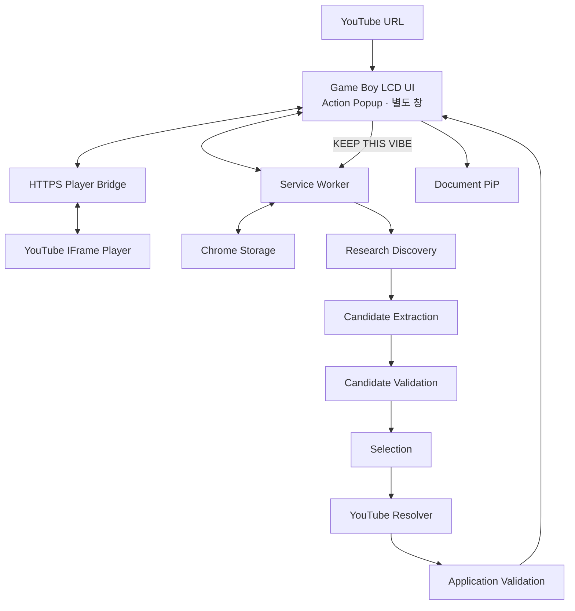

# Pixel Jukebox 기획서

> YouTube 링크를 Game Boy 감성의 Player에서 재생·관리하고, 필요할 때만 OpenAI 기반 `KEEP THIS VIBE`로 현재 곡의 흐름을 이어갈 Playlist를 큐레이션하는 Chrome Extension

## 1. 프로젝트 목적

Pixel Jukebox는 Chrome Desktop 환경에서 YouTube 음악 감상, Playlist 관리, AI 기반 음악 큐레이션을 제공하는 Manifest V3 Chrome Extension이다.

### 해결하려는 문제

- 현재 듣는 곡과 자연스럽게 이어지는 음악을 찾기 위해 YouTube 검색·추천·댓글·Playlist를 반복 탐색하는 과정
- 추천 결과가 실제 재생 가능한 YouTube 영상인지 다시 확인해야 하는 과정
- 음악 감상과 추천 탐색이 분리되어 생기는 사용성 저하

### 제공 가치

```text
YouTube URL 입력
        ↓
Game Boy Player
        ↓
Playlist 관리
        ↓
KEEP THIS VIBE
        ↓
AI Playlist 큐레이션
        ↓
실제 YouTube 영상 검증
```

Core Player는 OpenAI 없이 독립 동작한다.

AI 기능은 사용자가 자신의 OpenAI API Key를 연결한 경우에만 활성화한다.

---

## 2. 범위

### 포함

| 영역 | 범위 |
| --- | --- |
| Extension | Manifest V3, Action Popup, 별도 Extension Window |
| Player | HTTPS Player Bridge, YouTube IFrame Player |
| Input | YouTube URL 입력·검증·재생 |
| Playlist | 자동 추가·삭제·순서 변경·반복·복구 |
| Design | Game Boy Shell / Screen / Button Tone |
| Controls | D-pad, A/B, SELECT/START, Volume / Mute |
| PiP | Document Picture-in-Picture |
| Ads | Extension Player 내부 Auto Skip Ads |
| Storage | Playlist, Design, Cache, AI 설정 |
| AI | OpenAI Responses API 기반 `KEEP THIS VIBE` |
| Resolver | YouTube 출처·oEmbed Metadata 검증 |
| 안정성 | AI 오류와 Core Player 오류 격리 |

### 제외

- PNG / GIF Export
- 자체 회원가입·로그인
- OpenAI Proxy Backend
- Multi-Agent
- Vector DB
- 자체 Recommendation Model
- AI의 자동 Playlist 재생 변경
- AI 생성 YouTube URL / Video ID 신뢰
- 음악 파일 다운로드·자체 스트리밍
- Firefox / Safari / 모바일 Extension
- 일반 사용자 대상 Chrome Web Store 운영
- Card Flip

---

## 3. 사용자 흐름

### 기본 사용

```text
Extension 실행
    ↓
Home
    ↓
Playlist
    ↓
YouTube URL 입력
    ↓
HTTPS Player Bridge
    ↓
YouTube IFrame Player
    ↓
Now Playing
    ↓
Playlist
```

새 YouTube Tab을 기본 재생 흐름으로 사용하지 않는다.

### LCD 메뉴

```text
HOME
├─ NOW PLAYING
├─ PLAYLIST
├─ KEEP THIS VIBE
└─ SETTINGS
```

모든 주요 기능은 Game Boy 본체의 LCD 안에서 전환한다.

본체 밖 별도 기능 Card나 Toolbox를 두지 않는다.

### 물리 버튼

| 버튼 | 역할 |
| --- | --- |
| D-pad ↑ / ↓ | 메뉴·목록 이동 |
| D-pad ← / → | Now Playing Previous / Next 등 화면별 이동 |
| A | 확인·선택 / Play-Pause |
| B | 뒤로·취소 |
| SELECT | Home |
| START | Settings |

클릭과 키보드 방향키 / Enter / Escape도 동일한 Navigation State를 사용한다.

---

## 4. 시스템 구조



### 실행 경계

**Extension UI**

- Home / Now Playing / Playlist / KEEP THIS VIBE / Settings
- 사용자 입력
- Player·Playlist·Design·PiP 조작

**Player Bridge**

- HTTPS 기반 YouTube 재생 전용
- `videoId`와 재생 제어 명령만 교환
- API Key·Playlist 전체 데이터·Chrome Storage 정보 전달 금지

**Service Worker**

- Storage 접근
- OpenAI API 호출
- Recommendation Workflow
- Extension 내부 메시지 처리

OpenAI 요청은 Service Worker에서만 수행한다.

---

## 5. Player Bridge

`chrome-extension://` 문맥에서 YouTube iframe 재생 시 발생한 Error 153 문제를 피하기 위해 HTTPS Player Bridge를 사용한다.

```text
Extension UI
    ↓
사용자별 HTTPS Player Bridge
    ↓
YouTube IFrame Player
```

개인 Bridge 주소를 Source Code에 고정하지 않는다.

각 사용자는:

```text
bridge.config.local.json
```

에 자신의 Bridge 주소를 설정한 뒤 빌드한다.

Fork 사용자를 위한 Bridge 배포 절차는 `README.md`에서 관리한다.

Bridge Protocol·GitHub Pages 배포 Workflow 같은 구현 세부는 코드와 README에서 관리한다.

---

## 6. Core Player

### URL Load

```text
URL 검증
→ videoId 추출
→ Bridge Load
→ oEmbed Metadata 조회
→ Playlist 중복 확인
→ Playlist 자동 추가
→ Now Playing 갱신
```

지원:

- `youtube.com/watch?v=...`
- `youtu.be/...`
- `youtube.com/shorts/...`

잘못된 URL은 기존 Player 상태를 유지하고 오류만 표시한다.

### Track

```text
videoId
videoTitle
channelTitle
thumbnail
videoUrl
playbackState
```

`channelTitle`을 Artist라고 단정하지 않는다.

### Playlist

- URL 입력 Track 자동 추가
- KEEP THIS VIBE Track 직접 추가
- Track 삭제
- Drag & Drop 순서 변경
- 순서 변경 대안 제공
- Previous / Next
- Play / Pause
- 마지막 Track 이후 Track 1 반복
- Chrome 재실행 후 복구
- 재생 없이 KEEP THIS VIBE 기준곡 선택 가능

### Player UX

- Playlist와 KEEP THIS VIBE Panel을 열어도 재생 유지
- 일반 메뉴 이동 시 재생 일시정지
- Now Playing에서 재생 재개
- Volume / Mute 상태 복구
- PiP 실행·복원
- Reduced Motion 대응

### Auto Skip Ads

Auto Skip Ads는 Extension의 중첩 YouTube Player에서 표시된 활성 Skip 버튼만 처리한다.

일반 YouTube 페이지나 다른 Tab에는 적용하지 않는다.

실제 광고에서 Auto Skip 동작을 확인했다.

---

## 7. Design

상세 UI 기준은 `DESIGN.md`를 SSOT로 사용한다.

핵심 기준:

- Game Boy DMG 스타일
- Home 시작
- 단일 LCD 화면 전환
- Video Screen과 Now Playing 중심
- D-pad / A·B / SELECT / START 물리 조작감
- Shell / Screen / Button Tone
- Soft UI / Glassmorphism / 과도한 3D 금지
- 기술 상태·Cache·Permission 내부 정보 상시 노출 금지
- Card Flip 미사용

### 반응형 검증 기준

검증 완료:

- 360px
- 390px
- 480px
- 720×480
- 1280×720
- 1920×1080

독립 창 확대 시 본체·영상·텍스트·조작부도 함께 확장한다.

높이가 부족한 창에서는 세로 Scroll로 조작부 접근을 유지한다.

---

## 8. OpenAI 연결

### 기본 정책

- AI 완전 Opt-in
- AI 미사용 시 OpenAI 요청 0건
- API Key 기본 저장: `chrome.storage.session`
- 영속 저장: 사용자 선택 시에만 `chrome.storage.local`
- Local 저장 전 `TRUSTED_CONTEXTS` 적용
- 접근 제한 실패 시 Local 저장 금지
- 저장된 Key 원문 재표시 금지

### 금지

- Source Code 포함
- Git Commit
- `storage.sync` 저장
- Console·오류 로그 출력
- DOM 삽입
- Runtime Message Payload 포함
- Authorization Header 로그

OpenAI 연결 UI:

```text
API KEY
[........................] [ CONNECT ]
```

별도 Enable / Save / Test / Verify 버튼을 만들지 않는다.

---

## 9. KEEP THIS VIBE

`KEEP THIS VIBE`는 단순 유사곡 검색이 아니라 현재 곡에서 자연스럽게 이어지는 Playlist 큐레이션 기능이다.

### 핵심 기준

- 현재 Track을 가장 강한 시작점으로 사용
- Playlist와 Recent Recommendations를 보조 문맥으로 사용
- 분위기·시대감·질감·감정선·에너지·보컬·Scene 고려
- “이 곡이 다음에 재생되면 흐름이 깨지는가?”를 핵심 판단 기준으로 사용
- 가까운 곡 / 같은 Scene / 탐색적인 곡을 혼합
- 같은 Artist 허용
- 동일 Artist 연속 배치·편중 방지
- 확인하지 못한 음악적 사실 생성 금지

### Workflow

```text
Current Track
+ Playlist
+ Recent Recommendations
        ↓
Research Discovery
20–30 Candidates
        ↓
Candidate Extraction
        ↓
Candidate Validation
        ↓
Selection
12–20 Tracks
        ↓
YouTube Resolver
        ↓
oEmbed Metadata Validation
        ↓
KEEP THIS VIBE
```

실제 Prompt는 Source Code에서 관리한다.

`.project/plan.md`에는 Prompt 전문을 중복 저장하지 않는다.

### Discovery

- Web Search 사용
- Candidate 목표 20–30곡
- 현재 Track·Playlist·최근 추천 중복 제외
- 같은 곡의 재업로드·Cover·변형보다 새로운 곡 우선
- 충분한 후보가 없으면 검증된 결과만 유지

### Candidate Validation

- Research 근거에 없는 Track 생성 금지
- Artist / Track 필수
- Artist + Track 중복 제거
- Current Track 중복 제거
- Playlist 중복 제거
- Recent Recommendations 중복 제거
- Candidate ID 형식·중복 검증

### Selection

- Web Search 미사용
- Candidate Set 내부 ID만 선택
- 목표 12–20곡
- 후보가 충분한데 12곡 미만이면 1회 Retry
- 각 Track의 독립 유사도보다 전체 재생 흐름 우선
- 목록 밖 Candidate ID 차단
- 중복 Candidate ID 차단

Reason / Tag는 최종 UI에서 사용하지 않는다.

---

## 10. YouTube Resolver

AI Candidate를 실제 YouTube Track으로 검증한다.

### 기준

- AI가 임의 작성한 URL / Video ID 신뢰 금지
- `YOUTUBE|...` 형식 우선
- 형식 누락 시 Web Search가 반환한 실제 YouTube 출처 사용
- 모델 본문의 임의 URL 사용 금지
- 첫 출처 실패 시 다음 검색 출처 검증
- 실제 oEmbed Metadata로 곡명·Artist 재검증
- 동일 `videoId` 중복 제거
- 검증 실패 Candidate 제외
- 남은 검증 Candidate로 결과 보충

### URL 정규화

다음 형태를 표준 Watch URL로 변환한다.

- `watch`
- `youtu.be`
- `live`
- `embed`

### 허용 영상 유형

- MV
- Performance
- Live
- Lyric
- Visualizer
- Audio
- Topic
- Official Other

### 제외

- Cover
- Reaction
- Karaoke
- Instrumental Cover
- Sped Up
- Slowed
- Nightcore
- Mashup
- Compilation
- Playlist
- 관련 없는 Shorts
- Metadata 불일치

검증 실패 영상을 목표 개수 충족을 위해 억지로 포함하지 않는다.

---

## 11. Cache · 오류 처리

### Cache

```text
cacheKey
=
currentTrack.videoId
+
playlistFingerprint
```

- Cache Hit 시 OpenAI 요청 0건
- `MORE LIKE THIS`는 Cache 우회
- 이전 추천은 Recent Recommendations에 반영

### 오류

구분:

- 인증
- Rate Limit
- 사용량·결제
- Network / Timeout
- Discovery 실패
- Candidate Extraction 실패
- Selection 실패
- YouTube Source 없음
- Resolver / Metadata 검증 실패

Selection 실패 시 동일 Candidate Set으로 1회 Retry한다.

Partial JSON을 임의 복구하지 않는다.

AI 오류는 Core Player와 격리한다.

API Key·Authorization·원본 API Response Body를 UI나 일반 로그에 노출하지 않는다.

---

## 12. 현재 구현 상태

완료:

- Manifest V3 Extension
- Action Popup · 별도 Window
- Game Boy 단일 LCD UI
- 반응형 UI
- HTTPS Player Bridge
- 사용자별 Bridge 설정
- Playlist 관리·복구
- Volume / Mute
- Auto Skip Ads 실제 광고 검증
- PiP 구조
- Design 설정
- OpenAI Key 연결 구조
- Research Discovery
- Candidate Extraction
- Candidate Validation
- Selection
- YouTube Resolver
- Recommendation Cache
- AI / Core Player 오류 격리

자동 검증:

```text
TypeScript Type Check
Vitest 66 tests
Production Build
Bridge Syntax Check
Manifest Check
Chrome UI Fixture
```

상세 구현·검증 이력은 `docs/results/*`에서 관리한다.

---

## 13. 제출 전 남은 범위

현재 기능 범위는 동결한다.

신규 기능보다 실제 동작·추천 품질·배포 완성도를 우선한다.

### 남은 검증

- 실제 OpenAI End-to-End
- 서로 다른 기준 곡의 KEEP THIS VIBE 품질
- Discovery Candidate 수
- Candidate Extraction 통과 수
- Selection 결과 수
- YouTube 출처 발견 수
- Resolver / Metadata 검증 통과 수
- 최종 추천 수
- 실제 OpenAI Usage
- 전체 응답 시간
- KEEP THIS VIBE 1회 비용
- 최종 Regression
- 제출 가능한 실행·설치 경로

실제 측정값과 검증 결과는 `docs/results/*`에 기록한다.

실측 후에만 Candidate 수·Batch 크기·Retry 정책을 조정한다.

### 허용되는 변경

- 실제 E2E 실패 수정
- 추천 품질 문제 수정
- Resolver 정확도 개선
- 비용·응답 시간 개선
- 배포·설치 문제 수정
- 제출을 막는 UX 오류 수정

신규 기능 추가는 기본적으로 진행하지 않는다.

---

## 14. 완료 기준

### Core Service

- [x] Chrome Extension 실행
- [x] Game Boy LCD UI
- [x] HTTPS Player Bridge 구조
- [x] 사용자별 Bridge 설정
- [x] Playlist
- [x] 반응형 UI
- [x] Volume / Mute
- [x] Auto Skip Ads 실제 검증
- [x] Design
- [x] 자동 테스트·빌드
- [ ] 최종 제출 버전 Regression 확인

### AI

- [x] Research Discovery
- [x] Candidate Extraction / Validation
- [x] Selection
- [x] YouTube Resolver
- [x] Cache
- [x] AI / Player 오류 격리
- [ ] 실제 OpenAI E2E
- [ ] 여러 기준 곡 추천 품질 검증
- [ ] 최종 결과 수 안정성 확인
- [ ] 실제 Usage·비용 확인

### 제출

- [x] Fork용 Bridge 구성·배포 문서
- [ ] 제출용 Extension 실행·설치 경로
- [ ] 심사자 실행 확인
- [ ] 서비스·설치 링크
- [ ] 제출 문구
- [ ] 최종 대표 Screenshot

---

## 15. 문서 기준

| 문서 | 역할 |
| --- | --- |
| `.project/plan.md` | 현재 프로젝트 범위·핵심 설계·완료 기준 |
| `AGENTS.md` | 저장소 공통 작업 규칙 |
| `DESIGN.md` | UI·Interaction 기준 |
| `README.md` | 실행·설치·Bridge 배포 안내 |
| `docs/results/*` | 실제 구현·검증 기록 |
| Source Code | Prompt·Protocol·구현 세부 |

기획 변경 시 `.project/plan.md`를 우선 수정한다.

완료된 기능의 과거 변경 이력이나 날짜별 작업 기록을 기획서에 누적하지 않는다.

실제 구현·검증 결과는 `docs/results/*`에 기록한다.
