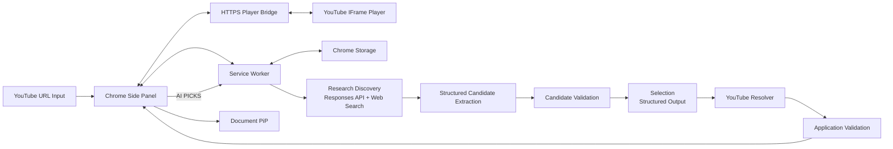

# Pixel Jukebox

> YouTube 링크를 입력해 Game Boy 감성의 Player에서 음악을 감상·관리하고, 필요할 때만 OpenAI 기반 `AI PICKS`로 비슷한 음악을 발견하는 Chrome Extension

## 1. 프로젝트 개요

Pixel Jukebox는 Chrome Desktop 환경에서 YouTube 음악 감상과 Playlist·AI 추천 기능을 제공하는 Manifest V3 기반 Chrome Extension이다.

YouTube 재생은 HTTPS Player Bridge를 통해 처리한다.

기본 흐름:

```text
YouTube URL 입력
        ↓
HTTPS Player Bridge
        ↓
YouTube IFrame Player
        ↓
NOW PLAYING
        ↓
Playlist
        ↓
선택적 AI PICKS
```

Core Player는 OpenAI 없이 독립 동작한다.

- YouTube URL 입력
- 새 Browser Tab 없는 재생
- YouTube 영상 직접 재생
- Game Boy 스타일 Player UI
- Playlist 자동 추가·삭제·순서 변경
- Previous / Play-Pause / Next
- 마지막 Track 이후 Track 1 반복
- Design 설정 및 저장
- Document Picture-in-Picture
- Playlist 및 설정 복구

`AI PICKS`는 OpenAI API Key 연결 완료 후 사용 가능하다.

구체적인 UI 기준은 `DESIGN.md`, 작업 규칙은 `AGENTS.md`를 따른다.

---

## 2. UX 기준

### YouTube URL 입력

Core Player의 기본 진입점:

```text
YOUTUBE LINK
[ https://www.youtube.com/watch?v=... ] [ ADD & PLAY ]
```

처리:

```text
URL 검증
→ videoId 확인
→ Player Bridge Load
→ Track 정보 확인
→ Playlist 자동 추가
→ NOW PLAYING 갱신
```

새 YouTube Tab 자동 생성 금지.

지원 링크:

- `youtube.com/watch?v=...`
- `youtu.be/...`
- `youtube.com/shorts/...`

### Playlist

`ADD & PLAY` 성공 시 Playlist 자동 추가.

별도 `ADD CURRENT TRACK`, `ADD TO PLAYLIST` 미사용.

중복 Track만 추가 차단.

AI 연결 여부와 Playlist 기능 완전 분리.

### Design

Game Boy 스타일 사용자화:

- Shell Tone
- Screen Tone
- Button Tone

변경값은 Preview 가능.

`SAVE` 선택 시에만 영속 저장.

### OpenAI Settings

최소 구성:

```text
OPENAI SETTINGS
[ API KEY                         ] [ CONNECT ]
```

`CONNECT`:

```text
Permission 요청
→ Session 저장
→ 인증 확인
→ 성공
→ AI PICKS 즉시 활성화
```

별도 Enable / Save / Test / Verify 버튼 미사용.

### AI PICKS

Compact Row:

```text
[Thumbnail] Track Title     [+]
```

표시:

- Thumbnail
- Track Title
- Playlist 추가 Action

기본 미표시:

- Reason
- Tag
- Candidate ID
- 내부 상태 문구
- Cache 상태
- Web Search 상태

추천곡은 실제 YouTube Track으로 Resolve된 경우에만 표시한다.

`SEARCH ON YOUTUBE` 미사용.

### Export

PNG / GIF 기능 제외.

### PiP

Document PiP 유지. 영상과 재생 버튼을 표시하고, 중복 클릭 시 기존 창을 재사용한다. 닫을 때 원래 플레이어로 복원하며 재생 상태와 현재 곡을 유지한다. 창 이동으로 iframe이 다시 로드될 때 재생 위치 복원에는 Bridge 시간 정보와 시작 위치 전달을 사용한다.

---

## 3. 범위

### 포함

| 영역 | 기능 |
|---|---|
| Extension | Manifest V3, Side Panel, Service Worker |
| Player Bridge | HTTPS 정적 페이지, YouTube IFrame Player |
| Input | YouTube URL 입력·검증·로드 |
| Player | YouTube 영상 재생, Play/Pause, Previous/Next |
| Playlist | 자동 추가·삭제·순서 변경·반복·상태 복구 |
| Design | Game Boy Shell / Screen / Button Tone, Save |
| PiP | Document Picture-in-Picture |
| Storage | Playlist, 설정, Cache |
| AI | 사용자 OpenAI API Key 연결 |
| AI PICKS | Research Discovery, Candidate Extraction / Validation, Selection, YouTube Resolver |
| AI PICKS | Compact Row, Playlist 직접 추가 |
| 안정성 | AI 오류와 Core Player 오류 격리 |

### 제외

| 영역 | 기능 |
|---|---|
| Export | PNG / GIF |
| UI | 독립 YouTube Connection 화면 |
| UI | 상시 OpenAI 상세 상태 화면 |
| UI | 내부 Cache / Permission 상태 노출 |
| Design | 고급 Theme Editor |
| Account | 자체 회원가입·로그인 |
| Backend | OpenAI Proxy Server |
| AI | Multi-Agent |
| AI | Vector DB |
| AI | 자체 Recommendation Model |
| AI | Playlist 자동 재생 변경 |
| Media | 음악 파일 다운로드·자체 스트리밍 |
| Browser | 새 YouTube Tab 기반 기본 재생 |
| Browser | Firefox·Safari·모바일 지원 |
| Distribution | 일반 사용자 대상 Chrome Web Store 운영 |

---

## 4. 전체 구조



Bridge는 Extension API와 분리된 HTTPS 재생 영역으로만 사용한다.

Bridge 전달 데이터는 `videoId`와 재생 제어 명령으로 제한한다.

OpenAI API Key와 Playlist 전체 데이터는 Bridge로 전달하지 않는다.

---

## 5. 기술 구성

| 영역 | 기술 |
|---|---|
| Extension | Chrome Extension Manifest V3 |
| 최소 Chrome | Chrome 140 |
| Language | TypeScript |
| UI | HTML / CSS / TypeScript |
| Build | Vite |
| Main UI | Chrome Side Panel |
| Background | Extension Service Worker |
| Player Bridge | GitHub Pages HTTPS |
| Video Player | YouTube IFrame Player API |
| Track Metadata | YouTube oEmbed |
| Messaging | `chrome.runtime`, `postMessage` |
| 영속 저장 | `chrome.storage.local` |
| Session 저장 | `chrome.storage.session` |
| PiP | Document Picture-in-Picture |
| AI | OpenAI Responses API |
| AI 탐색 | OpenAI Web Search |
| AI 출력 | Candidate Extraction / Selection Structured Outputs |
| Test | Vitest |

Vanilla TypeScript 기준.

UI Framework 선반영 금지.

---

## 6. Player Bridge

### 목적

`chrome-extension://`에서 YouTube iframe을 직접 재생할 때 발생한 Error 153 회피.

구조:

```text
Side Panel
→ HTTPS Player Bridge
→ YouTube IFrame Player
```

### 기본 Bridge URL

```text
https://seoheejung.github.io/pixel-jukebox/player.html
```

실제 배포 완료 후 Chrome에서 검증한다.

### Bridge Protocol

교환 허용:

```text
init
load
play
pause
state
error
```

검증:

- `event.origin`
- `event.source`
- `videoId`
- 허용 명령

Bridge로 전달 금지:

- OpenAI API Key
- Playlist 전체 데이터
- Chrome Storage 데이터
- Extension API 권한 정보

### 배포

GitHub Pages Source:

```text
GitHub Actions
```

배포 Workflow:

```text
.github/workflows/deploy-player-bridge.yml
```

실제 Pages 배포 전 Bridge 기능 완료 처리 금지.

---

## 7. Core Player

### URL Load

```text
URL 검증
→ videoId 추출
→ Bridge Load
→ oEmbed Metadata 조회
→ Playlist 중복 확인
→ Playlist 자동 추가
→ NOW PLAYING 갱신
```

잘못된 URL은 기존 Player 상태 유지 + 한 줄 오류 표시.

### Track 정보

```text
videoId
videoTitle
channelTitle
thumbnail
videoUrl
playbackState
```

`channelTitle`을 Artist라고 단정하지 않는다.

### Playlist

- URL 입력 Track 자동 추가
- AI PICKS Track 직접 추가
- Track 삭제
- Drag & Drop 순서 변경
- Previous / Next
- Play / Pause
- 마지막 Track 이후 Track 1 반복
- Chrome 재실행 후 Playlist 복구
- Playlist Track 선택 시 Bridge에 직접 Load

### Design

Game Boy Style:

```text
Shell Tone
Screen Tone
Button Tone
```

처리:

```text
변경
→ Preview
→ SAVE
→ chrome.storage.local
```

### PiP

- NOW PLAYING
- Track Title
- Channel
- Previous / Play-Pause / Next

PiP 실패와 Main Player 오류 분리.

---

## 8. OpenAI Key

### 기본 저장

`chrome.storage.session`:

```text
openaiApiKey
```

### 선택적 영속 저장

```text
사용자 선택
→ setAccessLevel(TRUSTED_CONTEXTS)
→ 성공: storage.local
→ 실패: Local 저장 금지 + session 유지
```

### OpenAI Settings

```text
API KEY
[........................] [ CONNECT ]
```

`CONNECT` 성공:

- OpenAI Permission 승인
- Session Key 저장
- 인증 확인
- AI PICKS 활성화
- Settings 자동 축소

실패:

- AI PICKS 비활성 유지
- 한 줄 오류 표시
- Key 재입력 가능

### Key 취급 기준

- Source Code 포함 금지
- Git Commit 금지
- `storage.sync` 저장 금지
- Console 출력 금지
- 오류 로그 출력 금지
- DOM 삽입 금지
- Runtime Message Payload 포함 금지
- Authorization Header 로그 금지
- 연결 해제 시 저장 Key 제거

OpenAI 요청은 Service Worker에서만 수행.

---

## 9. 이어 듣기 (기존 AI PICKS)

현재 곡의 느낌을 자연스럽게 이어갈 다음 5–8곡을 순서대로 제안한다. 사용자 표시 이름은 ‘이어 듣기’이며 내부 메시지·화면 ID는 기존 이름을 유지한다. LP로 열면 Now Playing을 벗어나거나 재생을 멈추지 않고 하단 슬라이드로 표시한다.

### 흐름

```text
Current Track
+
Playlist
+
Recent Recommendations
        ↓
Discovery
        ↓
Structured Candidate Extraction
        ↓
Candidate Validation
        ↓
Candidate Set
        ↓
Selection
        ↓
YouTube Resolver
        ↓
Application Validation
        ↓
Compact AI PICKS
```

### Discovery

- 현재 Track 최우선
- Playlist 재생 순서와 현재 곡 위치를 문맥으로 사용
- 분위기·에너지·템포 느낌·그루브·질감·보컬·프로덕션의 자연스러운 전환 우선
- YouTube 업로드일과 원곡 발매일 구분, 확인하지 못한 연도·음악적 특성 생성 금지
- 발매 시기·장르·언어·아티스트 다양성은 보조 기준이며 급격한 분위기 전환을 피함
- 같은 곡의 재업로드·커버·리믹스보다 새로운 곡과 아티스트 다양성 우선
- 최근 추천·명백한 중복 제외
- Web Search 실행 필수, 현재 곡 식별과 음악적 맥락 확인 후 후보 탐색
- Candidate 최대 15개, 검증된 서로 다른 5–8곡을 목표로 후보 보충
- Web Research는 간결한 근거 메모로 받고, 별도 Structured Output 요청이 근거에 명시된 Artist / Track만 추출
- 추출 결과가 비면 Recent Recommendations 제외를 완화하고 인접 서브장르·분위기·에너지·악기·보컬·프로덕션까지 넓힌 Discovery를 1회만 재실행

출력:

```json
{
  "candidates": [
    { "artist": "Artist", "title": "Track" }
  ]
}
```

### Candidate Extraction / Validation

- Research 근거에 없는 곡 생성 금지
- Structured JSON Schema
- Artist / Track 필수값
- Artist + Track 중복
- 현재 Track 중복
- Playlist 중복
- 최근 추천 중복
- 검증 후 로컬 Candidate ID 부여

### Selection

Web Search 미사용.

Candidate Set 내부 ID에서 가능한 경우 5–8개 선택한다. 첫 곡은 현재 곡에, 이후 곡은 앞선 추천곡에 자연스럽게 이어지는 순서로 선택한다. 검증 결과가 부족하면 남은 후보를 최대 5개씩 보충 검색하며, 추가 검색 후에도 선택한 순서를 유지한다. 후보 소진 후에는 검증된 부분 결과만 반환하고 부족한 개수를 안내한다.

현재 Track·Playlist·Recent Recommendations 문맥을 Selection에도 전달한다. 현재 곡과의 음악적 유사성을 가장 우선하고 발매 시기 근접성 및 아티스트 다양성을 함께 고려해 순위를 정한다. 불확실한 음악적 사실은 추측으로 채우지 않는다.

최종 UI에서 Reason / Tag 미사용.

```json
{
  "recommendations": [
    {
      "candidateId": "C01"
    }
  ]
}
```

Candidate Set 외 ID 차단.

### YouTube Resolver

AI Candidate를 실제 YouTube Track으로 Resolve.

필수 결과:

```text
candidateId
videoId
videoTitle
thumbnail
videoUrl
```

기준:

- AI 생성 Video ID/URL 신뢰 금지
- Resolve 성공 Candidate만 UI 표시
- Resolve 실패 Candidate 폐기
- 첫 검색에서 확인한 곡은 누락 곡의 개별 보충 검색이 실패해도 부분 결과로 유지
- 동일 videoId 결과 중복 제외
- 새 Browser Tab 생성 금지

### Recommendation Row

```text
[Thumbnail] Track Title     [+]
```

`+`:

```text
Playlist 직접 추가
→ 새 Tab 없음
```

### 실패 처리

Selection 실패:

```text
동일 Candidate Set
→ Selection 1회 Retry
```

후보가 비었을 때만 제외 조건을 완화한 Discovery를 1회 재실행한다. 형식 오류를 임의 복구하거나 무제한 재검색하지 않는다.

Partial JSON 자동 복구 금지.

요청 중에는 기준 곡과 단계별 진행 문구(후보 탐색·유사도 비교·YouTube 검색·영상 확인)를 표시한다. 실패하면 원인과 조치 및 `RETRY`를 제공한다. API가 제공한 HTTP 상태·오류 코드·대상 파라미터·요청 ID와 정제한 오류 설명으로 요청 실패를 진단할 수 있어야 한다. API Key·Authorization·원본 응답 본문은 메시지나 UI로 전달하지 않는다. 요청 빈도 제한과 사용량 부족, 네트워크·시간 초과, 잘못된 응답, 검색 결과 없음과 영상 조회 실패를 구분한다.

### Cache

```text
cacheKey
=
currentTrack.videoId
+
playlistFingerprint
```

Cache Hit 시 OpenAI 요청 0건.

`REFRESH PICKS`는 Cache 우회.

---

## 10. Side Panel 화면 기준

> 2026-09-09 LCD 메뉴 개편이 이 절의 이전 본체 밖 보조 도구 구성을 대체한다. YouTube Link, Playlist, AI Picks, Appearance, OpenAI, PiP는 모두 고정 크기 LCD 안의 화면으로 제공하며 본체 밖 카드나 toolbox를 두지 않는다.

- Home: Now Playing / Playlist(count) / Add Music / 이어 듣기 / Settings

2026-09-12 조작 기준: API Key 연결 성공은 AI Picks로 이동한다. Playlist 방향키는 제목만 순회하고 삭제 버튼은 클릭·Tab으로 접근한다. Now Playing 안에서 하단 슬라이딩 목록을 열고 닫으며 재생을 유지한다. 베젤 문구와 예전 카드 여백을 제거하고 A/B 라벨 굵기를 일정하게 유지한다.
- SELECT: 항상 Home, START: Settings, A: 확인·재생/일시정지, B: 뒤로·취소
- D-pad: 메뉴 상하 이동, Now Playing 좌우 곡 이동
- 클릭과 키보드 방향키/Enter/Escape도 같은 내비게이션 상태를 사용
- 메뉴로 이동할 때 재생 중인 영상은 일시정지하고, Now Playing에서 A로 재개
- Settings: Appearance / OpenAI / 지원 환경의 Mini player(PiP) / Open Window

2026-09-11 스크린샷 후속 기준: popup의 기본 크기를 유지하고 별도 창은 최소 레이아웃보다 작게 축소하지 않으며 창 확대에 맞춰 본체와 LCD를 확장한다. Now Playing 글자를 줄여 영상 공간을 확보하고 하단 배경색 단절을 제거한다. LP 버튼은 AI Picks 이동과 현재 곡 검색을 실행하며 기존 연결 조건·중복 요청 방지를 유지한다. Document PiP API가 없는 환경에서는 Mini Player 메뉴와 화면을 노출하지 않는다. 완료·실패 시 로딩 표시를 숨긴다.
- LCD 내부 목록은 스크롤하며 320/390/480px 폭과 짧은 높이에서 가로 넘침이 없어야 한다.

Game Boy 스타일 단일 기기 화면. 2026-09-09 LCD 메뉴 기준으로 영상과 현재 곡, Home, Playlist, AI PICKS, Add Music, Settings를 같은 고정 크기 LCD 안에서 전환한다. 왼쪽 십자키·오른쪽 대각선 A/B·하단 SELECT/START·스피커 홈은 본체 조작부로 유지하며, 본체 밖 기능 카드나 toolbox를 두지 않는다.

```text
┌──────────────────────────────┐
│ PIXEL JUKEBOX          POWER │
│ ┌──────────────────────────┐ │
│ │      VIDEO SCREEN        │ │
│ └──────────────────────────┘ │
│                              │
│ NOW PLAYING                  │
│ Track Title                  │
│ Channel                      │
│                              │
│                        [A]   │
│    [十]           [B]        │
│                              │
│       SELECT   START    //// │
└─────────────────────────────╯
  YOUTUBE LINK / ADD & PLAY
  보조 도구: Playlist / AI PICKS
  접힌 설정: Design / OpenAI
```

제거:

```text
YOUTUBE CONNECTION
EXPORT
PNG / GIF
ADD CURRENT TRACK
SEARCH ON YOUTUBE
RECOMMENDATIONS READY
CONFIGURED · SESSION ONLY
대형 LP
대형 AI 상태 Card
```

---

## 11. Phase 0 — Extension 기반 구성

검증 완료:

- [x] Manifest V3
- [x] Chrome 140 이상
- [x] Vite / TypeScript Build
- [x] Service Worker
- [x] Side Panel
- [x] Runtime Messaging
- [x] 최소 Permission

---

## 12. Phase 1 — URL Input · Player

기존 검증 완료:

- [x] URL 입력
- [x] Video ID / Title / Channel / Thumbnail
- [x] LP/CD Rotation
- [x] Play/Pause
- [x] Previous / Next
- [x] Playlist 자동 추가

Bridge 전환 구현:

- [x] 직접 `chrome-extension:// → YouTube iframe` 제거
- [x] HTTPS Player Bridge 연동
- [x] `postMessage` Protocol
- [x] origin / source / videoId 검증
- [x] YouTube oEmbed Metadata 조회
- [x] Manifest CSP 변경
- [x] GitHub Pages Workflow 작성

외부 검증:

- [ ] GitHub Pages 실제 배포
- [ ] Bridge URL 200 응답
- [ ] Chrome에서 Error 153 해소
- [ ] 실제 영상 재생
- [ ] Play / Pause / Previous / Next
- [ ] Autoplay 동작 확인

---

## 13. Phase 2 — Playlist · Design · PiP

기존 검증 완료:

- [x] Playlist 관리
- [x] Drag & Drop
- [x] 반복 재생
- [x] 저장·복구
- [x] Document PiP
- [x] PiP Controller

로컬 구현 완료 (2026-09-08, 실제 Chrome 동작 미검증):

- [x] Export 구현·UI·Test 제거
- [x] Game Boy Design 적용
- [x] Shell / Screen / Button Tone 설정
- [x] Design `SAVE` 버튼
- [x] Design 자동 영속 저장 제거

Design / Interaction 로컬 구현 완료 (2026-09-09, 실제 Chrome 검증 결과는 별도 기록):

- [x] Button Press Motion
- [x] Playlist Drag Motion
- [x] Disc Inertia Rotation
- [x] AI Card Hover / Flip
- [x] Shell / Screen Material Highlight
- [x] 단일 LCD 화면 전환과 물리 버튼·키보드 공통 내비게이션

구현 우선순위는 Press / Drag / Rotate → 약한 금속·유리 재질 → AI 카드 Flip → 홀로그램 Hover이다. Game Boy 기본 톤과 Shell / Screen / Button 구조, Compact AI PICKS, OpenAI CONNECT 및 Export 제거를 유지한다. Disc는 NOW PLAYING의 작은 보조 요소로 한정하고 대형 LP 영역을 복원하지 않는다.

본체 가장자리의 약한 금속 하이라이트, 화면 보호판 가장자리의 약한 유리 반사만 허용한다. 전체 유리 카드 UI, 크롬 메탈 본체, 상시 홀로그램, 대형 3D 추천 카드와 Player보다 눈에 띄는 효과는 금지한다. 카드 상세는 기존 검증된 Track 정보만 사용하며 추가 AI 호출을 만들지 않는다. 키보드 조작과 Motion 감소 환경, PiP 이동·복원 시 정리를 포함한다.

구현·검증 기록: [Game Boy Material / Motion / PiP](../docs/results/gameboy-material-motion-pip.md).

---

## 14. Phase 3 — OpenAI 연결

구현·검증 완료:

- [x] Optional Host Permission
- [x] Session Key
- [x] 선택적 Local 저장
- [x] `TRUSTED_CONTEXTS`
- [x] Key 노출 차단

UX 로컬 구현 완료 (2026-09-08, 실제 연결 미검증):

- [x] API Key + `CONNECT` 단일 Action
- [x] 별도 Enable / Save / Test 제거
- [x] 연결 성공 시 AI PICKS 즉시 활성화
- [x] 연결 성공 후 Settings 자동 축소
- [x] 내부 상태 Badge 제거

외부 검증:

- [ ] 실제 OpenAI API Key 인증
- [ ] 실제 OpenAI 네트워크 요청

---

## 15. Phase 4 — AI Recommendation

기존 구현·자동 검증 완료:

- [x] Discovery / Selection 분리
- [x] Candidate Extraction / Validation
- [x] Candidate Set
- [x] Structured Output
- [x] Candidate Whitelist
- [x] Selection 1회 Retry
- [x] Core Player 오류 격리

로컬 구현 완료 (2026-09-08, Resolver는 Mock 단위 검증):

- [x] Selection Schema에서 Reason / Tag 제거
- [x] YouTube Resolver 구현·검증
- [x] Compact Recommendation Row
- [x] `SEARCH ON YOUTUBE` 제거
- [x] Playlist 직접 추가
- [x] 추천 선택 시 새 Tab 미사용
- [x] 내부 기술 상태 문구 제거
- [x] Web Research와 Structured Candidate Extraction 분리
- [x] 빈 후보 시 완화된 Discovery 1회 재실행
- [x] 기준 곡·단계별 진행·오류 후 Retry 표시
- [x] 보충 검색 실패 시 검증된 부분 결과 유지

검증 명령 및 잔여 항목: [Game Boy UI 후속 작업 결과](../docs/results/gameboy-ui-followup.md).

외부 검증:

- [ ] 실제 Responses API
- [ ] 실제 Web Search
- [ ] 실제 YouTube Resolve
- [ ] 실제 Recommendation Playlist 추가

---

## 16. Phase 5 — Cache · 안정성

구현·자동 검증 완료:

- [x] Cache Hit 시 OpenAI 요청 0건
- [x] REFRESH PICKS Cache 우회
- [x] Recent Recommendations
- [x] Selection Retry
- [x] Partial JSON 폐기
- [x] Panel별 동시 중복 추천 요청 차단
- [x] 인증 / Rate Limit / 사용량 오류 분류
- [x] AI 비활성 상태 OpenAI 요청 0건
- [x] Permission / Key 노출 검토
- [x] Remote Hosted Code 검토

재검증:

- [ ] Player Bridge 기준 Cache Context
- [ ] Resolver 실패 격리
- [ ] Playlist 직접 추가 후 Fingerprint
- [ ] 실제 OpenAI Usage
- [ ] 실제 비용
- [ ] 실제 Rate Limit 응답

---

## 17. 전체 완료 기준

### Core UX

- [ ] YouTube URL 직접 입력
- [ ] 새 Browser Tab 없는 재생
- [ ] HTTPS Player Bridge 실제 배포
- [ ] Error 153 해소
- [ ] Playlist 자동 추가
- [ ] NOW PLAYING 즉시 반영
- [x] Game Boy 단일 LCD UI 로컬 구현

### Player

- [ ] YouTube 영상 정상 재생
- [ ] Play/Pause
- [ ] Previous/Next
- [ ] Playlist 관리 및 반복
- [ ] Design `SAVE`
- [ ] Document PiP
- [ ] Export 기능 없음

### OpenAI

- [x] Session Key 구조
- [x] 선택적 Local Key 구조
- [x] Local 접근 제한
- [x] API Key 노출 방지
- [ ] Key + `CONNECT` 단일 UX
- [ ] 연결 즉시 AI PICKS 활성화
- [ ] 실제 OpenAI 인증

### AI PICKS

- [x] Discovery / Selection 구조
- [x] Candidate Extraction / Validation / Whitelist
- [x] Selection Retry
- [x] Cache
- [x] YouTube Resolver Mock 검증
- [x] Compact Thumbnail + Title Row
- [x] Playlist 직접 추가 로컬 구현
- [ ] 실제 Discovery / Selection / Resolve

2026-09-11 자동 검증은 Vitest 7 files / 52 tests, TypeScript, Vite build, Bridge 문법, Manifest 검사까지 통과했다. 실제 OpenAI·YouTube 호출은 수행하지 않았다. Chrome fixture에는 기준 곡·진행·Retry·pixel loader·Reduced Motion assertion이 포함되어 있으나, 현재 환경에서 DevTools WebSocket 연결 오류로 assertion 실행 전에 종료되어 실제 브라우저 UI는 미검증이다.

---

## 18. 문서 운영 기준

2026-09-12 추가 요청: 추천 후보·최종 목록에 아티스트당 1곡을 지시하고 기준 곡과 다른 가수를 우선한다. 재생 화면에 음량/음소거와 저장 기능을 추가하며, Settings의 Auto Skip Ads 설정은 이 확장의 중첩 YouTube 플레이어에 표시된 활성 Skip 버튼만 자동 클릭한다. 이를 위해 `https://www.youtube.com/embed/*`에만 콘텐츠 스크립트를 등록하고 확장 origin·부모 bridge ancestry를 확인한다. 일반 YouTube 페이지에는 적용하지 않는다. [음량·광고 후속 결과](../docs/results/volume-auto-skip.md) 참조.

2026-09-12 사용자 후속 요구사항: SIMILAR VIBES에서 Playlist 기준 곡을 재생 없이 선택한다. 선택 목록은 LCD 내부에 제한하며, 기준 곡 ID를 저장된 Playlist에서 검증한다. 추천은 원래 발매 연도·장르·언어를 우선하고 분위기·보컬을 다음으로 고려한다. LP는 자동 검색 없이 하단 패널을 열고, 재생 화면의 Playlist는 곡 선택 후 닫힌다. 중복 정보 버튼과 미검증 Mini Player 메뉴를 제거한다. Home 간격 확대, LCD 중복 로고 제거, 물리 버튼 입체감을 적용한다. 구현·검증은 [후속 결과](../docs/results/similar-vibes-source-controls.md)를 따른다.

최신 후속 검증(2026-09-12): 테스트 7개 파일·55개, 타입 검사·빌드·Bridge·manifest·PNG 아이콘 검사, 제한 밖 로컬 Chrome fixture가 통과했다. LCD 테마·스크롤바·슬라이딩 목록·연결 후 이동·창 크기 확대를 확인했다. 이전 Phase의 Chrome 실패는 당시 기록으로 보존한다. 실제 OpenAI·YouTube 요청과 Document PiP 창 생성은 미검증이며 [최신 결과](../docs/results/menu-playlist-search-followup.md)를 따른다.

프로젝트 범위 최종 기준:

```text
사용자의 현재 명시적 지시
        ↓
.project/plan.md
        ↓
현재 Phase 지침서
        ↓
DESIGN.md
        ↓
AGENTS.md
        ↓
README.md
```

- URL 입력 중심 UX 유지
- 새 Browser Tab 없는 재생 유지
- Player Bridge는 재생 전용으로 제한
- Game Boy 스타일 디자인 유지
- AI와 Core Player 기능 의존 금지
- 버튼 수 최소화
- 기술 상태의 불필요한 UI 노출 금지
- AI Recommendation Card Compact 구성
- Export 기능 제외
- Design `SAVE` 기반 저장
- 구현하지 않은 결과 완료 처리 금지
- 기획 변경 시 `.project/plan.md` 우선 수정
- 실제 구현·검증 결과는 Phase 결과 문서에 기록
