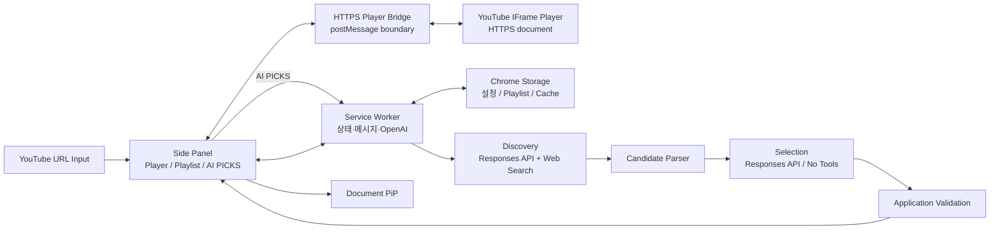

# Pixel Jukebox

> YouTube 링크를 입력해 음악을 LP/CD 형태로 감상·관리하고, 필요할 때만 OpenAI 기반 `AI PICKS`로 비슷한 음악을 발견하는 Chrome Extension

## 1. 프로젝트 개요

Pixel Jukebox는 Chrome Desktop 환경에서 YouTube 음악 감상 경험을 확장하는 Manifest V3 기반 Extension이다.

사용자 중심 기본 흐름:

```text
YouTube URL 입력
        ↓
Track 로드
        ↓
LP / CD Player
        ↓
Playlist
        ↓
선택적 AI PICKS
```

Core Player는 OpenAI 없이 독립 동작한다.

- YouTube URL 입력
- Track 정보 및 재생 상태 동기화
- LP/CD 회전 Player
- Playlist 추가·삭제·순서 변경
- Previous / Play-Pause / Next
- 마지막 Track 이후 Track 1 반복
- 간단한 Disc / Theme 설정
- HTTPS Player Bridge 기반 YouTube Player
- Document Picture-in-Picture
- Playlist 및 설정 저장

`AI PICKS`는 선택 기능이다.

API Key가 없는 상태에서 `AI PICKS`를 실행하면 최소 연결 UI를 표시하고, Key 연결 성공 후 추천 흐름을 이어서 실행한다.

구체적인 Pixel UI 기준은 `DESIGN.md`, 작업 규칙과 문서 우선순위는 `AGENT.md`를 따른다.

### 현재 아키텍처 기준

Player 권한은 `chrome-extension://` 페이지의 직접 YouTube iframe에서 `HTTPS Player Bridge`가 호스팅하는 YouTube iframe으로 변경한다.

- YouTube URL 입력은 새 YouTube 탭을 열거나 기존 탭을 재사용하지 않는다.
- Side Panel은 고정 HTTPS Bridge iframe에만 `postMessage` 명령을 전송한다.
- HTTPS Bridge 안의 YouTube IFrame Player가 영상 로드·재생·일시정지의 단일 권한자다.
- Bridge와 Side Panel은 고정된 origin과 `event.source`를 함께 검증한다.
- YouTube 페이지 Content Script와 `tabId` 기반 상태 동기화는 Player 경로에서 사용하지 않는다.
- AI 추천 선택도 새 YouTube 탭 대신 Bridge Player에 로드한다.
- 구현 작업은 이 아키텍처 기준을 반영한 계획 변경 이후에만 진행한다.

### 구현 상태 구분

- `기존 검증 완료`: 유지 가능한 도메인·보안·저장 로직
- `UX 보정 필요`: 이번 재설계에서 반드시 교체하거나 축소할 UI·연결 흐름
- `외부 검증`: 실제 Chrome·YouTube·OpenAI 환경에서 추가 확인할 항목

---

## 2. UX 우선 기준

### 메인 입력

YouTube URL 입력을 Core Player의 기본 진입점으로 고정한다.

```text
YouTube URL
[ https://www.youtube.com/watch?v=... ] [ ADD & PLAY ]
```

`ADD & PLAY` 처리:

```text
URL 검증
→ videoId 확인
→ HTTPS Player Bridge에 load 명령 전송
→ Playlist 자동 추가
→ Bridge의 YouTube Player 재생
```

새 YouTube 탭 열기, 기존 YouTube 탭 재사용, YouTube Content Script 동기화는 사용하지 않는다.

### Playlist 추가

유효한 Track 로드가 완료되면 `ADD & PLAY` 요청으로 Playlist에 자동 추가한다.

AI 추천 카드에는 명시적인 `ADD TO PLAYLIST` 버튼을 제공한다.

OpenAI API Key, AI Permission, AI 연결 상태와 무관한 독립 기능.

이미 Playlist에 존재하는 Track만 중복 추가 차단.

### AI PICKS

메인 화면에 별도 `OPENAI CONNECTION` 대형 영역 미사용.

```text
AI PICKS 클릭
        ↓
API Key 존재?
  ├─ YES → 추천 실행
  └─ NO  → 최소 Key 입력 UI
                ↓
           연결 성공
                ↓
           추천 실행
```

Key 저장 완료 후 별도 연결 상태·Ready 문구를 상시 표시하지 않는다.

### Design

독립 대형 `DESIGN` Section 미사용.

사용자화 범위:

- Disc Style: LP / CD
- Background
- Accent

변경은 Preview에 먼저 반영하고 명시적인 `SAVE` 선택 후 저장한다.

Panel / Text 색상은 별도 세부 조절보다 가독성 기준 자동 처리 우선.

고급 Theme Editor, 다단계 Style 설정, 불필요한 시각 옵션 추가 금지.

### OpenAI Settings

`OPENAI SETTINGS`는 API Key 입력과 단일 `CONNECT` 동작만 제공한다.

- Key 입력 후 `CONNECT` 시 연결 및 `AI PICKS` 활성화 자동 처리
- 상세 연결 상태, Permission, 진단 버튼, 별도 연결·해제 버튼 미표시
- 빈 값 저장은 기존 Key 제거로 처리

### YouTube Connection

독립 `YOUTUBE CONNECTION` UI 제거.

정상 연결 상태는 별도 카드로 표시하지 않는다.

연결 실패, Track 미로드 상태에서만 필요한 안내 표시.

---

## 3. 프로젝트 목표

### Core Player

```text
YouTube URL
        ↓
HTTPS Player Bridge
        ↓
YouTube IFrame Player
        ↓
LP/CD Visual Player · Controller
        ↓
Playlist · PiP · 최소 Design
```

OpenAI 연결 없이 전체 Core Player 사용 가능.

### AI PICKS

```text
현재 Track
+
Playlist
+
최근 추천 기록
        ↓
Discovery
        ↓
Candidate Set
        ↓
Selection
        ↓
Application Validation
        ↓
AI PICKS
```

AI 실행은 사용자 요청 시에만 발생한다.

---

## 4. 범위

### 포함

| 영역 | 기능 |
|---|---|
| Extension | Manifest V3, Side Panel, Service Worker |
| Input | YouTube URL 입력·검증·로드 |
| YouTube | HTTPS Player Bridge, IFrame Player, Track 정보·재생 상태 |
| Player | LP/CD 회전, Play/Pause, Previous/Next |
| Playlist | 추가·삭제·순서 변경·반복 재생·상태 복구 |
| Design | LP/CD, Background, Accent |
| PiP | Document Picture-in-Picture, 기본 Controller |
| Storage | Playlist, 설정, Cache 저장 |
| AI | 사용자 OpenAI API Key 연결 |
| AI PICKS | Discovery, Candidate Parser, Selection, Validation |
| AI PICKS | 추천 최대 5곡, Thumbnail·Title·Artist/Channel, `ADD TO PLAYLIST` |
| 안정성 | AI 오류와 Core Player 오류 격리 |

### 제외

| 영역 | 기능 |
|---|---|
| UI | 독립 YouTube Connection 관리 화면 |
| UI | 상시 노출 OpenAI Connection 대형 화면 |
| Design | 고급 Theme Editor |
| Account | 자체 회원가입·로그인 |
| Backend | OpenAI Proxy Server |
| AI | Multi-Agent |
| AI | Vector DB |
| AI | 자체 Recommendation Model |
| AI | Playlist 자동 변경 |
| AI | 추천곡 자동 재생 |
| YouTube | AI의 Video ID·URL 임의 생성 |
| Media | 음악 파일 다운로드·자체 스트리밍 |
| Browser | Firefox·Safari·모바일 지원 |
| Distribution | 일반 사용자 대상 Chrome Web Store 운영 |

---

## 5. 전체 구조



Player authority is the YouTube iframe hosted by the HTTPS Player Bridge. The Side Panel controls only the bridge through an origin-checked `postMessage` protocol. The Service Worker owns storage and OpenAI requests; it does not open or control a YouTube tab.

기본 Bridge 배포 대상은 `https://seoheejung.github.io/pixel-jukebox/player.html`이다. 정적 파일은 `player-bridge/`에 두고 GitHub Pages workflow로 배포한다. 배포 origin 변경 시 Extension CSP와 Bridge URL을 함께 변경한다.

---

## 6. 기술 구성

| 영역 | 기술 |
|---|---|
| Extension | Chrome Extension Manifest V3 |
| 최소 Chrome | Chrome 140 |
| Language | TypeScript |
| UI | HTML / CSS / TypeScript |
| Build | Vite |
| Main UI | Chrome Side Panel |
| Background | Extension Service Worker |
| YouTube 연동 | HTTPS Player Bridge + YouTube IFrame Player API |
| Messaging | `chrome.runtime` |
| 영속 저장 | `chrome.storage.local` |
| Session 저장 | `chrome.storage.session` |
| PiP | Document Picture-in-Picture |
| AI | OpenAI Responses API |
| AI 탐색 | OpenAI Web Search |
| AI 최종 출력 | Structured Outputs / JSON Schema |
| Test | Vitest |

Vanilla TypeScript 기준.

UI Framework 선반영 금지.

---

## 7. 핵심 설계 결정

### Chrome 최소 버전

프로젝트 최소 지원 버전:

```json
{
  "minimum_chrome_version": "140"
}
```

Chrome 140은 특정 API 최초 지원 버전이 아닌 프로젝트 기준 버전.

### YouTube URL 입력

사용자의 직접 입력을 기본 진입점으로 사용.

지원 대상:

- `youtube.com/watch?v=...`
- `youtu.be/...`

추가 URL 형태는 실제 필요 확인 후 확장.

URL 입력 자체로 Playlist 자동 추가 금지.

Track 로드 완료 후 사용자가 `ADD TO PLAYLIST` 선택.

### HTTPS Player Bridge

재생 식별자는 `videoId` 기준.

HTTPS Bridge 역할:

- YouTube IFrame Player API로 영상 로드
- Play / Pause / Previous / Next 제어
- Player state event를 Track 상태로 변환
- 검증된 `postMessage`로 Side Panel과 실제 재생 상태 동기화

Side Panel 역할:

- 고정 Bridge URL만 iframe으로 로드
- Bridge origin 및 iframe `contentWindow` 검증
- 유효한 `videoId`와 허용된 명령만 Bridge에 전달
- OpenAI Key, Playlist 전체 데이터, Extension API를 Bridge에 전달하지 않음

YouTube 페이지 Content Script, 현재 Tab 감지, `tabId` 상태 분리는 사용하지 않는다.

URL 입력과 AI 추천의 영상 로드는 모두 Bridge의 검증된 `load` 메시지 경로를 사용한다.

### AI Opt-in

OpenAI API 호출 발생 조건:

- `AI PICKS`
- `REFRESH PICKS`

API Key가 없는 상태의 `AI PICKS` 클릭은 Key 입력 흐름 시작.

Key 연결 성공 후 기존 AI PICKS 요청 재개.

Playlist, PiP, Design 기능과 AI 연결 상태 분리.

### AI 장애 격리

OpenAI 인증 오류, Rate Limit, 응답 파싱 실패, 추천 실패와 Core Player 오류 분리.

### 공개 배포

현재 BYOK 구조는 개인 개발·학습·포트폴리오 범위.

일반 사용자 대상 공개 서비스 전환 시 Backend Proxy, 인증, Secret 관리, Rate Limit, Abuse 방지, 비용 정책 별도 기획.

---

## 8. Core Player

### URL Load

The HTTPS Player Bridge-hosted YouTube iframe is the only playback authority. URL input sends a validated `videoId` through the bridge protocol; it never opens or reuses a YouTube tab.

입력:

```text
YouTube URL
```

처리:

```text
URL 검증
→ videoId 추출
→ YouTube 영상 로드
→ Track 메타데이터 확인
→ Player 활성화
```

잘못된 URL은 Player 상태 변경 없이 입력 오류 표시.

### Track 정보

수집 대상:

```text
videoId
videoTitle
channelTitle
thumbnail
videoUrl
playbackState
```

`channelTitle`을 Artist라고 단정하지 않는다.

### Playlist

지원 기능:

- 로드된 Track 추가
- Track 삭제
- Drag & Drop 순서 변경
- Previous / Next
- Play / Pause
- 마지막 Track 이후 Track 1 반복
- Chrome 재실행 후 Playlist 복구

`ADD TO PLAYLIST` 비활성 조건:

- 유효한 Track 미로드
- 현재 Track이 이미 Playlist에 존재

OpenAI 연결 여부를 비활성 조건으로 사용하지 않는다.

### Design

지원 범위:

- LP / CD
- Album Artwork
- 재생 상태 연동 Rotation
- Background
- Accent

Design은 Secondary Settings로 제공.

변경값은 Preview에 먼저 반영하고 명시적인 `SAVE` 선택 후 저장한다.

독립 대형 화면 및 고급 Theme Editor 제외.

### Document PiP

지원 범위:

- Disc
- Rotation
- Track 정보
- Previous
- Play / Pause
- Next

Feature Detection:

```ts
'documentPictureInPicture' in window
```

PiP 실패와 Side Panel Player 오류 분리.

---

## 9. Storage 및 OpenAI Key

### 일반 데이터

`chrome.storage.local`:

```text
settings
playlist
recommendationCache
recentRecommendations
aiPreferences
```

### API Key 기본 저장

`chrome.storage.session`:

```text
openaiApiKey
```

브라우저 세션 단위 기본 저장.

### API Key 영속 저장

사용자 명시적 선택 시에만 Local 저장 시도.

```text
영속 저장 선택
        ↓
setAccessLevel(TRUSTED_CONTEXTS)
        ↓
성공 ──→ storage.local 저장
실패 ──→ Local 저장 금지 + session 유지
```

### Key 취급 기준

- Source Code 포함 금지
- Git Commit 금지
- `storage.sync` 저장 금지
- Console 출력 금지
- 오류 로그 출력 금지
- Embedded Player 전달 금지
- DOM 삽입 금지
- Runtime Message Payload 포함 금지
- Authorization Header 로그 금지
- AI 연결 해제 시 저장 Key 제거

OpenAI 요청은 Service Worker에서만 수행.

### OpenAI 설정 UI

상시 대형 Connection Section 미사용.

API Key 미설정 상태:

```text
OPENAI SETTINGS
→ API Key 입력
→ CONNECT
→ AI PICKS 자동 활성화
```

설정 UI에는 API Key 입력과 `CONNECT`만 표시하며 Connected, Ready, Permission, 진단, 연결·해제 버튼을 표시하지 않는다.

---

## 10. AI PICKS

### 실행 흐름

```text
Current Track
+
Playlist
+
Recent Recommendations
        ↓
Discovery
        ↓
Candidate Parser
        ↓
Candidate Set
        ↓
Selection
        ↓
Application Validation
        ↓
AI PICKS
```

단일 Recommendation Workflow 구성.

Multi-Agent 미사용.

### Discovery

- 현재 Track 최우선 신호
- Playlist 보조 문맥
- 최근 추천 및 명백한 중복 제외
- Web Search 기반 후보 탐색
- Candidate 최대 10개 초기값
- Strict Structured Output 미사용

출력:

```text
CANDIDATE|C01|Artist|Track
CANDIDATE|C02|Artist|Track
```

### Candidate Parser

검증 대상:

- Line Format
- Candidate ID
- Artist / Track 필수값
- Candidate ID 중복
- Artist + Track 중복
- 현재 Track 중복
- Playlist 중복
- 최근 추천 중복

파싱 불가 Line 폐기.

### Candidate Set

```ts
interface CandidateTrack {
  candidateId: string;
  artist: string;
  title: string;
  channelTitle?: string;
  thumbnail?: string;
  videoId?: string;
  videoUrl?: string;
}
```

`Verified Candidate Set` 표현 미사용.

### Selection

Web Search 미사용.

Candidate Set 내부 ID에서 최대 5개 선택.

```json
{
  "recommendations": [
    {
      "candidateId": "C01",
      "reason": "현재 곡의 몽환적인 기타 질감과 유사",
      "tags": ["dreamy", "indie"]
    }
  ]
}
```

Artist / Track 재생성 금지.

Candidate ID 기준 Candidate 원본 결합.

AI 카드에 표시할 Thumbnail·Title·Artist/Channel은 Candidate 원본에서 제공한다.

`ADD TO PLAYLIST`는 검증된 YouTube URL/videoId가 있는 Candidate만 허용한다. videoId는 Web Search 결과의 YouTube URL에서 애플리케이션이 추출·검증하며, AI가 임의로 생성한 ID·URL은 사용하지 않는다.

추천 선택은 새 YouTube 탭이 아니라 HTTPS Player Bridge의 `load` 메시지 경로로만 연결한다.

### Application Validation

- JSON Parse
- JSON Schema
- 최대 5개
- Candidate ID 존재
- Candidate ID 중복 차단
- Candidate Set 외 ID 차단
- Reason 존재
- Tag 1~3개

### 실패 처리

Selection 실패 시 동일 Candidate Set으로 1회 Retry.

Retry 시 Discovery 재실행 금지.

Partial JSON 자동 복구 금지.

### Cache

Cache Key:

```text
currentTrack.videoId
+
playlistFingerprint
```

Cache Hit 시 OpenAI 요청 0건.

`REFRESH PICKS`는 Cache 우회 및 기존 추천의 `recentRecommendations` 반영.

---

## 11. OpenAI 모델 정책

모델명 단일 설정 관리.

선정 기준:

- Responses API 지원
- Web Search 지원
- Structured Outputs 지원
- 비용
- 응답 시간
- 실제 추천 품질

실제 외부 API 검증 전 모델 품질 확정 금지.

---

## 12. Side Panel 화면 기준

### AI PICKS Card

Each recommendation card is compact and contains only:

- Thumbnail
- Title
- Artist / Channel
- `ADD TO PLAYLIST`

Do not render `SEARCH ON YOUTUBE`, `READY`, Connected, or other technical status text in the card. Adding a verified recommendation loads it through the embedded Player path and does not open a new YouTube tab.

메인 화면 우선순위:

```text
1. YouTube URL Input
2. Current Player
3. Player Controller
4. Playlist
5. AI PICKS
6. Secondary Actions
```

Secondary Actions:

```text
PiP · Settings
```

상시 노출 금지 대상:

- YOUTUBE CONNECTION 대형 Card
- OPENAI CONNECTION 상세 Card
- DESIGN 대형 Section
- Storage 내부 상태
- Permission 내부 상태

기술 상태는 오류 해결에 필요한 경우에만 사용자 노출.

---

## 13. Phase 0 — Extension 기반 구성

### 목표

Manifest V3 기반 최소 Extension 실행 구조 검증.

### 범위

- Manifest V3
- `minimum_chrome_version: "140"`
- Vite / TypeScript Build
- Service Worker
- Side Panel
- HTTPS Player Bridge client
- Bridge 정적 페이지
- Runtime Messaging for Service Worker and Side Panel
- 최소 Permission

### 완료 기준

- [x] Extension Build 및 Developer Mode 로드
- [x] HTTPS Player Bridge client 및 정적 페이지 구현
- [ ] GitHub Pages Bridge 배포 및 Side Panel 로드
- [x] Side Panel 실행
- [x] Service Worker ↔ Side Panel 통신
- [x] 최소 Permission 검증

---

## 14. Phase 1 — YouTube Input · Player

### 목표

YouTube URL 입력 기반 HTTPS Player Bridge 진입과 재생 상태 동기화.

### 기존 검증 완료

- [x] Video ID 검증 및 Thumbnail 구성
- [ ] 배포된 Bridge의 Title / Channel 확인
- [ ] 배포된 Bridge의 Play / Pause 상태 감지
- [ ] HTTPS Bridge Player state event 실환경 처리
- [x] LP/CD Disc 및 Rotation
- [x] 기본 Controller
- [x] YouTube Tab 의존성 제거

### UX 보정 필요

- [x] Side Panel YouTube URL 입력
- [x] URL 검증 및 videoId 추출
- [x] 입력 URL 기준 Bridge load 명령 구현
- [ ] 배포된 HTTPS Bridge에서 로드 완료 후 Player 자동 반영
- [x] YouTube Tab·Content Script 경로 미사용 확인
- [x] 유효한 Track 로드 후 Playlist 추가 가능 상태 제공

### 완료 기준

- [x] URL 입력 → Track 로드 → Player 반영
- [x] 잘못된 URL 오류 처리
- [ ] HTTPS Bridge Player state event 후 Player 재동기화
- [x] 새 YouTube Tab 미생성
- [x] AI 연결과 Player 사용성 완전 분리

---

## 15. Phase 2 — Playlist · Design · PiP

### 기존 검증 완료

- [x] 여러 Track Playlist 관리
- [x] Drag & Drop 순서 변경
- [x] 반복 재생
- [x] Playlist / Design 저장·복구
- [x] Document PiP 실행
- [x] PiP Controller 및 오류 격리

### UX 보정 필요

- [x] `ADD TO PLAYLIST`와 AI 상태 의존성 제거
- [x] 독립 YOUTUBE CONNECTION 영역 제거
- [x] Design을 Disc / Background / Accent 중심으로 축소
- [x] Design Preview와 `SAVE` 흐름 정리
- [x] PiP / Settings Action 정리

### 완료 기준

- [x] Playlist 핵심 기능 유지
- [x] Track 로드 직후 Add 가능
- [x] 중복 Track만 Add 차단
- [x] Core Player 중심 Side Panel 구성
- [x] Design의 보조 기능화

---

## 16. Phase 3 — OpenAI 연결

### 기존 검증 완료

- [x] OpenAI Optional Host Permission
- [x] Session Key 저장
- [x] 선택적 Local 저장
- [x] `TRUSTED_CONTEXTS`
- [x] Service Worker Key 조회
- [x] Side Panel 외부 Context Key 접근 차단
- [x] Key 로그·메시지 노출 차단

### UX 보정 필요

- [x] OPENAI SETTINGS를 Key 입력·CONNECT만으로 축소
- [x] Key 저장 후 AI PICKS 자동 활성화
- [x] Connected / Ready / Permission / 진단 UI 미표시

### 외부 검증

- [ ] 실제 사용자 API Key 인증
- [ ] 실제 OpenAI 네트워크 요청

---

## 17. Phase 4 — AI Recommendation

### 구현·자동 검증 완료

- [x] Discovery / Selection 분리
- [x] Candidate Parser
- [x] Candidate Set
- [x] Structured Output Schema
- [x] Candidate ID Whitelist
- [x] 최대 5개 Recommendation
- [x] 한국어 Reason
- [x] Tag
- [x] Candidate YouTube URL/videoId 검증 및 Embedded Player 연결
- [x] Selection 1회 Retry
- [x] Discovery 재실행 차단
- [x] Core Player 오류 격리

### 외부 검증

- [ ] 실제 Responses API 호출
- [ ] 실제 Web Search 실행
- [ ] 실제 Candidate 생성
- [ ] 실제 Selection Structured Output
- [ ] 실제 추천 결과 확인

---

## 18. Phase 5 — Cache · 안정성 검증

### 구현·자동 검증 완료

- [x] Cache Hit 시 OpenAI 요청 0건
- [x] REFRESH PICKS Cache 우회
- [x] Recent Recommendations
- [x] Selection Retry
- [x] Partial JSON 폐기
- [x] 인증 / Rate Limit / 사용량 오류 분류
- [x] AI 비활성 상태 OpenAI 요청 0건
- [x] Permission / Key 노출 검토
- [x] Remote Hosted Code 검토

### 외부 검증

- [ ] 실제 OpenAI Usage
- [ ] 실제 비용
- [ ] 실제 Rate Limit 응답
- [ ] 실제 AI PICKS Cache 동작 확인

---

## 19. 전체 완료 기준

### Core UX

- [x] YouTube URL 직접 입력
- [x] URL 기준 Track 로드
- [x] Current Player 자동 반영
- [x] `ADD TO PLAYLIST`의 AI 비의존성
- [x] YOUTUBE CONNECTION 독립 영역 없음

### Player

- [ ] 배포된 HTTPS Player Bridge의 Track 상태 감지
- [x] LP/CD Rotation
- [x] Playlist 관리 및 반복
- [x] Document PiP
- [x] 최소 Design UI 보정
- [x] Design Preview → `SAVE` 흐름 보정

### OpenAI

- [x] AI Opt-in 구조
- [x] Session Key 기본 저장
- [x] 선택적 Local Key
- [x] Local 접근 제한
- [x] API Key 노출 방지
- [x] OPENAI SETTINGS Key 입력·CONNECT 및 AI PICKS 자동 활성화 UX
- [ ] 실제 OpenAI 인증

### AI PICKS

- [x] Discovery / Selection 구현
- [x] Candidate Parser / Whitelist
- [x] Selection Retry
- [x] Cache
- [ ] 실제 Discovery Web Search
- [ ] 실제 Structured Output
- [ ] 실제 Recommendation 결과

---

## 20. 기술 근거 및 검증 상태

| 항목 | 기준 |
|---|---|
| Side Panel | Chrome 114+ / MV3+ 공식 확인 |
| `sidePanel.open()` | Chrome 116+ 공식 확인 |
| Document PiP | Chrome 116+ 공식 확인 |
| `storage.local` | 기본 10MB, 현재 공식 문서 기준 |
| `storage.session` | 메모리 저장, HTTPS Bridge 비노출 |
| `storage.local.setAccessLevel()` | 현재 Chrome 공식 문서 기재 |
| `TRUSTED_CONTEXTS` 실제 차단 | Phase 3 실측 |
| OpenAI Client-side Key | 공식적으로 비권장 |
| Responses API Web Search | 공식 지원 |
| Structured Outputs | 공식 지원 |
| Discovery / Selection 분리 | 프로젝트 설계 결정 |
| Selection Retry 1회 | 프로젝트 초기값 |
| Candidate 10개 | 프로젝트 초기값 |
| 추천 5개 | 프로젝트 초기값 |
| 최소 Chrome 140 | 프로젝트 결정 |
| URL 입력 중심 UX | 프로젝트 핵심 요구사항 |
| Prompt 추천 품질 | 실제 OpenAI 외부 검증 대상 |

Web Search와 Structured Output은 한 요청에서 결합하지 않는다.

---

## 21. 공식 자료

- [Chrome Side Panel API](https://developer.chrome.com/docs/extensions/reference/api/sidePanel)
- [Chrome Storage API](https://developer.chrome.com/docs/extensions/reference/api/storage)
- [Document Picture-in-Picture](https://developer.chrome.com/docs/web-platform/document-picture-in-picture)
- [Chrome Extension Permissions](https://developer.chrome.com/docs/extensions/develop/concepts/declare-permissions)
- [Chrome Remote Hosted Code](https://developer.chrome.com/docs/extensions/develop/migrate/remote-hosted-code)
- [Chrome MV3 Additional Requirements](https://developer.chrome.com/docs/webstore/program-policies/mv3-requirements)
- [YouTube IFrame Player API](https://developers.google.com/youtube/iframe_api_reference)
- [YouTube API Client Identity](https://developers.google.com/youtube/terms/required-minimum-functionality#api-client-identity-and-credentials)
- [OpenAI API Key Safety](https://help.openai.com/en/articles/5112595-best-practices-for-api-key-safety)
- [OpenAI Web Search](https://developers.openai.com/api/docs/guides/tools-web-search)
- [OpenAI Structured Outputs](https://developers.openai.com/api/docs/guides/structured-outputs)

---

## 22. 문서 운영 기준

프로젝트 범위의 최종 기준은 `.project/plan.md`.

```text
사용자의 현재 명시적 지시
        ↓
.project/plan.md
        ↓
현재 Phase 지침서
        ↓
DESIGN.md
        ↓
AGENT.md
        ↓
README.md
```

- 현재 명시적 UX 요구 최우선
- URL 입력 중심 Core Player 유지
- AI와 Core Player 기능 의존 금지
- 기술 내부 상태의 불필요한 UI 노출 금지
- 기능보다 사용자 흐름 우선
- 구현하지 않은 결과의 완료 상태 기록 금지
- 기획 변경 시 `.project/plan.md` 우선 수정
- 실제 구현·검증 결과의 Phase 결과 문서 기록
