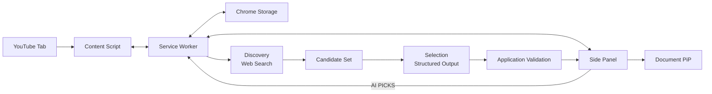

# Pixel Jukebox

> YouTube에서 재생 중인 음악을 LP/CD 형태로 시각화하고 Playlist를 관리하며, 선택적으로 OpenAI 기반 `AI PICKS`를 사용할 수 있는 Chrome Extension

## 프로젝트 개요

Pixel Jukebox는 Chrome Desktop 환경에서 YouTube 음악 감상 경험을 확장하는 Manifest V3 기반 Extension 프로젝트입니다.

기본 Player는 AI 없이 동작하며, 사용자가 `AI PICKS`를 활성화한 경우에만 자신의 OpenAI API Key를 이용해 현재 Track과 Playlist 문맥을 기준으로 비슷한 음악을 탐색합니다.

현재 저장소는 **기획 및 Phase별 구현 기준이 확정된 상태**이며, 실제 기능은 Phase 단위로 구현·검증합니다.

## 주요 기능

### Core Player

- 현재 YouTube 영상 및 재생 상태 감지
- LP/CD 회전 Player
- Playlist 추가·삭제·순서 변경
- 이전·다음 Track 및 반복 재생
- 색상 및 Disc Style 설정
- PNG/GIF 저장
- Document Picture-in-Picture
- Playlist 및 사용자 설정 복구

### AI PICKS

- 사용자 OpenAI API Key 기반 선택 기능
- 현재 Track + Playlist 문맥 기반 추천
- Web Search 기반 Candidate 탐색
- Candidate Set 기반 최종 Selection
- Structured Output 검증
- 추천 이유 및 Music Tag
- YouTube 검색 연결
- Recommendation Cache
- AI 오류와 Core Player 오류 격리

> AI PICKS를 사용하지 않으면 OpenAI API 요청은 발생하지 않습니다.

---

## 전체 구조



---

## 기술 구성

| 영역 | 기술 |
|---|---|
| Extension | Chrome Extension Manifest V3 |
| 최소 Chrome | Chrome 140 |
| Language | TypeScript |
| UI | HTML / CSS / TypeScript |
| Build | Vite |
| Main UI | Chrome Side Panel |
| Background | Extension Service Worker |
| YouTube 연동 | Content Script |
| Storage | `chrome.storage.local`, `chrome.storage.session` |
| PiP | Document Picture-in-Picture |
| AI | OpenAI Responses API |
| AI 탐색 | OpenAI Web Search |
| AI 출력 | Structured Outputs / JSON Schema |
| Test | Vitest |

UI Framework는 초기 범위에 포함하지 않습니다.

---

## AI PICKS 구조

```text
Current Track
+
Playlist
+
Recent Recommendations
        ↓
Discovery
Responses API + Web Search
        ↓
Candidate Parser
        ↓
Candidate Set
        ↓
Selection
Responses API / No Tools
        ↓
Structured Output
        ↓
Application Validation
        ↓
AI PICKS
```

Web Search와 Strict Structured Output은 동일 요청에서 사용하지 않습니다.

Selection은 Candidate ID만 선택하며 Artist와 Track을 새로 생성하지 않습니다.

---

## 프로젝트 Phase

| Phase | 범위 | 상태 |
|---|---|---|
| Phase 0 | Extension 기반 구성 | 예정 |
| Phase 1 | YouTube Player | 예정 |
| Phase 2 | Playlist · Design · Export · PiP | 예정 |
| Phase 3 | OpenAI 연결 | 예정 |
| Phase 4 | AI Recommendation | 예정 |
| Phase 5 | Cache · 안정성 검증 | 예정 |

구현 완료 여부는 실제 실행과 테스트 결과로만 변경합니다.

---

## 문서 구조

```text
pixel-jukebox/
├── .project/
│   └── plan.md
├── AGENT.md
├── DESIGN.md
├── README.md
└── docs/
    └── instructions/
        ├── phase0-extension-base.md
        ├── phase1-youtube-player.md
        ├── phase2-playlist-design-export-pip.md
        ├── phase3-openai-connection.md
        ├── phase4-ai-recommendation.md
        └── phase5-cache-stability.md
```

### 문서 역할

| 문서 | 역할 |
|---|---|
| `.project/plan.md` | 무엇을 만들 것인지와 전체 범위 |
| `AGENT.md` | 작업 규칙, Phase 범위, 검증 기준 |
| `DESIGN.md` | Pixel UI, Layout, Color, Component 기준 |
| `docs/instructions/phaseN-*.md` | 현재 Phase 구현·검증 지침 |
| `README.md` | 프로젝트 개요와 현재 진행 상태 |

### 우선순위

```text
사용자의 현재 명시적 지시
        ↓
.project/plan.md
        ↓
현재 Phase 지침서
        ↓
DESIGN.md
        ↓
AGENT.md
        ↓
README.md
```

---

## OpenAI API Key 정책

기본 API Key 저장소는 `chrome.storage.session`입니다.

사용자가 명시적으로 영속 저장을 선택한 경우에만 `chrome.storage.local` 저장을 시도하며, `TRUSTED_CONTEXTS` 접근 제한이 실제로 동작하는지는 Phase 3에서 직접 검증합니다.

OpenAI는 Client-side 환경에 API Key를 배포하는 방식을 권장하지 않으므로, 현재 BYOK 구조는 개인 개발·학습·포트폴리오 범위로 한정합니다.

일반 사용자 대상 공개 서비스로 전환할 경우 Backend Proxy, 인증, Secret 관리, Rate Limit, Abuse 방지, 비용 정책을 별도 기획합니다.

---

## 실행

현재는 구현 전 단계이므로 실행 명령을 문서에 선반영하지 않습니다.

Phase 0에서 실제 Build와 Chrome Developer Mode 실행을 검증한 뒤 검증된 명령만 README에 추가합니다.
