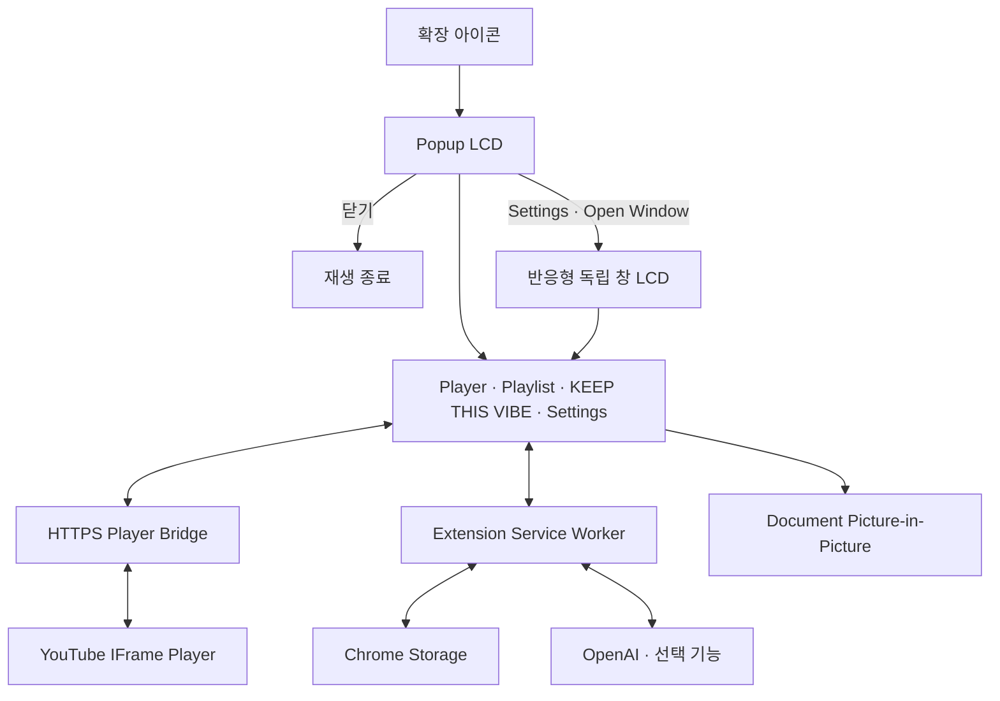

# Pixel Jukebox

> 현재 곡의 분위기를 이어갈 Playlist를 AI가 큐레이션하고, 실제 YouTube 영상까지 검증해 재생하는 레트로 픽셀 스타일 Chrome Extension

<p align="center">
  
  
  
</p>

## 프로젝트 개요

Pixel Jukebox는 Chrome Desktop에서 동작하는 Manifest V3 확장 프로그램이다. Core Player는 OpenAI 없이 사용할 수 있으며, `KEEP THIS VIBE`를 실행할 때만 사용자의 OpenAI API Key로 현재 곡의 흐름을 이어갈 Playlist를 탐색한다.

## 해결하려는 문제

현재 곡의 분위기를 이어갈 음악을 찾으려면 YouTube 검색, 추천 영상, Playlist를 반복해서 탐색해야 한다.

Pixel Jukebox는 현재 곡과 Playlist 흐름을 기준으로 다음에 이어 들을 음악을 AI가 큐레이션해 이 탐색 과정을 줄인다.

## 주요 기능

### Core Player

- HTTPS Player Bridge 기반 YouTube 재생
- Playlist 추가·삭제·순서 변경과 이전·다음·반복 재생
- 음량·음소거, 광고 자동 건너뛰기, 사용자 설정 복구
- D-pad, A/B, SELECT/START와 키보드 조작
- Popup, 반응형 독립 창, Document Picture-in-Picture
- 본체·LCD·버튼 색상 설정

### KEEP THIS VIBE

- 현재 곡을 중심으로 분위기·시대감·질감·감정선이 이어지는 후보 탐색
- Discovery 20–30곡에서 Selection 12–20곡을 구성
- OpenAI Web Search와 Structured Outputs 기반 큐레이션
- 실제 YouTube 출처와 oEmbed Metadata로 곡·Artist 일치 여부 검증
- 검증된 결과만 추천 순서대로 표시하고 Playlist에 바로 추가
- Cache와 중복 요청 병합, `MORE LIKE THIS` 재탐색, 실패 시 부분 결과 유지

## AI 활용 방식

```text
Current Track + Playlist + Recent Recommendations
                         ↓
                 Research Discovery
                         ↓
                 Candidate Extraction
                         ↓
                 Candidate Validation
                         ↓
                      Selection
                         ↓
                   YouTube Resolver
                         ↓
                 oEmbed Metadata Validation
                         ↓
                  KEEP THIS VIBE
```

OpenAI Responses API와 Web Search로 후보를 조사하고, 검증된 Candidate 안에서 Playlist 흐름을 구성한다. AI가 생성한 YouTube URL을 그대로 사용하지 않고 실제 검색 출처와 YouTube Metadata를 재검증한다.

## 전체 구조



## 기술 구성

| 영역 | 기술 |
| --- | --- |
| Extension | Chrome Extension Manifest V3 · Chrome 140 이상 |
| Language | TypeScript |
| UI | HTML · CSS · TypeScript |
| Build · Test | Vite · Vitest |
| Player | GitHub Pages · YouTube IFrame Player API |
| Storage | `chrome.storage.local` · `chrome.storage.session` |
| AI | OpenAI Responses API · Web Search · Structured Outputs |

## 빠른 실행

> 제공된 Player Bridge를 사용할 경우 별도 Fork나 Bridge 배포는 필요하지 않다.

1. [Pixel Jukebox Repository](https://github.com/seoheejung/pixel-jukebox)를 clone하고 Node.js 22.12 이상을 준비한다.
2. 저장소 루트에서 의존성을 설치한다.

```sh
npm ci
```

3. `bridge.config.example.json`을 `bridge.config.local.json`으로 복사하고 제공된 Bridge URL을 입력한다.

```sh
cp bridge.config.example.json bridge.config.local.json
```

PowerShell:

```powershell
Copy-Item bridge.config.example.json bridge.config.local.json
```

설정값:

```json
{
  "url": "https://seoheejung.github.io/pixel-jukebox/player.html"
}
```

4. Extension을 빌드한다.

```sh
npm run build
```

5. Chrome `chrome://extensions`에서 개발자 모드를 켜고 **압축해제된 확장 프로그램을 로드합니다**로 `dist/`를 선택한다.
6. YouTube URL을 입력해 재생한다.
7. `KEEP THIS VIBE`를 사용하려면 Settings에서 OpenAI API Key를 입력하고 `CONNECT`를 누른다. Core Player 재생에는 API Key가 필요하지 않다.

`bridge.config.local.json`은 빌드 전 필요한 로컬 설정이며 Git에 포함되지 않는다.

## 상세 설치 및 실행

Node.js 22.12 이상이 필요하다.

### Extension 빌드

`bridge.config.local.json` 설정을 완료한 뒤 빌드한다.

```sh
npm ci
npm run build
```

1. `chrome://extensions`에서 **개발자 모드**를 활성화한다.
2. **압축해제된 확장 프로그램을 로드합니다**를 선택한다.
3. 빌드된 `dist/` 디렉터리를 연다.
4. Pixel Jukebox 아이콘을 눌러 Popup을 실행한다.

코드를 변경한 뒤에는 다시 빌드하고 확장을 새로고침한다.

### KEEP THIS VIBE 설정

Settings의 OpenAI 화면에서 `CONNECT`를 눌러 필요한 host 권한을 승인하고 API Key를 등록한다. 현재 UI에서 Key는 `chrome.storage.session`에만 저장되며 Chrome 세션이 끝나면 제거된다.

API Key 조회와 OpenAI 호출은 Service Worker에서만 처리한다. Key를 소스, Git, 로그, Runtime 메시지 또는 Player 프레임에 포함하지 않는다.

### 자체 Player Bridge 배포

제공된 Player Bridge 대신 자신의 Bridge를 사용하려는 경우 저장소를 Fork하고 GitHub Pages에 `player-bridge/`를 배포한다.

1. GitHub 저장소의 **Settings → Pages → Source**에서 **GitHub Actions**를 선택한다.
2. **Actions → Deploy player bridge → Run workflow**를 실행한다.
3. `bridge.config.example.json`을 `bridge.config.local.json`으로 복사한다.
4. 복사한 파일에 자기 Bridge 주소를 입력한다.

```json
{
  "url": "https://YOUR_USERNAME.github.io/YOUR_REPOSITORY/player.html"
}
```

빌드 시 이 주소가 Player URL, CSP와 프레임 검증 설정에 함께 반영된다. 설정이 없거나 올바른 HTTPS 페이지 주소가 아니면 빌드가 중단된다. `bridge.config.local.json`은 Git에 포함되지 않는다.

자체 Bridge를 사용하는 경우 `bridge.config.local.json`에 해당 주소를 설정한 뒤 빌드한다. `dist/`에는 빌드 시 설정한 Bridge 주소가 포함된다.

## 검증

```sh
npm run typecheck
npm test
npm run check:bridge
npm run check:manifest
```

빌드 후 Chrome fixture를 실행할 수 있다.

```sh
npm run test:chrome:bridge
npm run test:chrome:ui
npm run test:chrome:audio
npm run test:chrome:audio:popup
```

실제 OpenAI E2E와 Usage·비용 측정 절차는 [측정 절차](docs/results/openai-e2e-runbook.md)를 따른다. API Key는 열린 Extension UI에 사용자가 직접 입력하며 측정 스크립트나 결과 파일에 전달하지 않는다.

실제 Bridge 재생은 `npm run chrome:start`로 연 테스트 프로필에서 확인하고, 검증 후 `npm run chrome:stop`으로 종료한다. Auto Skip Ads와 Document PiP는 최종 Regression에서 확인했다. 실제 OpenAI E2E·Usage 측정 결과는 `docs/results/openai-e2e-*.md`에 기록한다.

## Known Limitations

- 최종 추천 수가 내부 목표 12곡에 미달할 수 있다.
- Resolver / video verification 처리 시간이 길 수 있다.
- E2E runner와 실제 UI 완료 상태의 동기화 문제가 남아 있다.

실제 OpenAI E2E 성공 보고서는 `docs/results/openai-e2e-*.md`에 보존하며, 실패·timeout 실행은 성공 근거로 사용하지 않는다.
