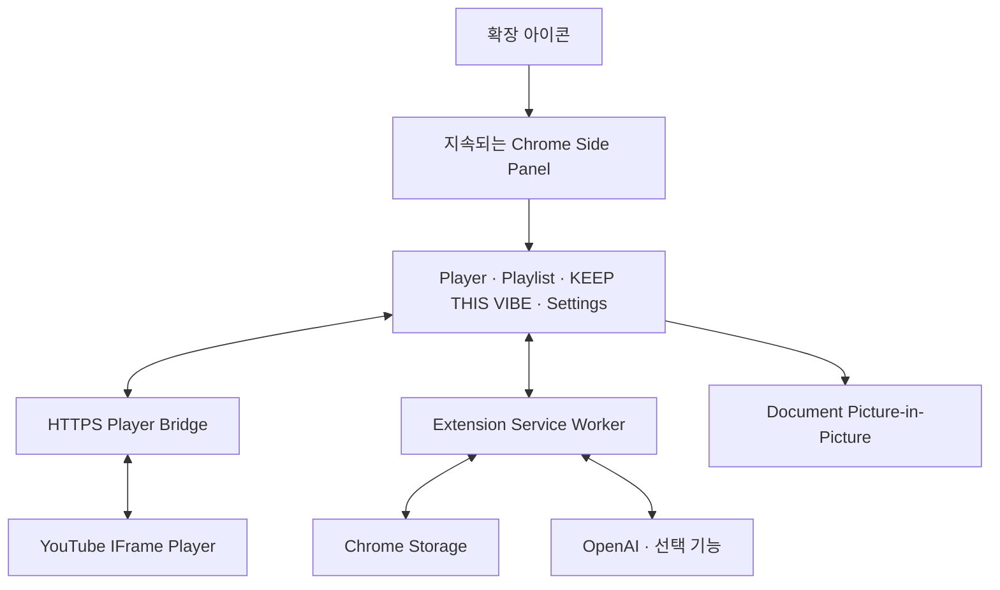

# Pixel Jukebox

> 현재 곡의 분위기를 이어갈 Playlist를 AI가 큐레이션하고, 실제 YouTube 영상까지 검증해 재생하는 레트로 픽셀 스타일 Chrome Extension

## Web Demo

**공식 제출 서비스:** <https://seoheejung.github.io/pixel-jukebox/>

Web Demo는 설치 없이 `KEEP THIS VIBE` 흐름을 체험하는 공식 제출 경로다.

실제 OpenAI API 호출이나 YouTube 재생은 발생하지 않으며,
기존 Chrome Extension E2E에서 검증된 3개 기준곡의 결과를 재현한다.

- Radiohead — No Surprises: 8곡
- NewJeans — Ditto: 5곡
- Tyler, The Creator — SEE YOU AGAIN: 3곡

기준곡을 선택한 뒤 `KEEP THIS VIBE`를 실행하면
해당 기준곡의 실제 E2E 검증 결과를 확인할 수 있다.
선택한 기준곡에 따라 8 / 5 / 3개의 검증 결과를 표시한다.

Home에서는 `REFERENCE TRACK`과 `KEEP THIS VIBE`만 제공한다.
D-pad와 A/B는 Demo 화면 안에서만 동작하며,
START는 Web Demo에서 비활성화되고 전체 Extension에서만 사용할 수 있다.

추천 결과는 표시 전용으로 YouTube 재생이나 외부 페이지 이동이 발생하지 않는다.

큐레이션 진행 재현은 동일 브라우저 탭 세션당 1회 실행할 수 있다.
완료 후에는 진행 애니메이션을 다시 실행하지 않고 검증된 추천 결과만 재열람한다.

| 구분 | 주소 | 용도 |
| --- | --- | --- |
| Web Demo | <https://seoheejung.github.io/pixel-jukebox/> | 심사자용 기본 실행 경로 |
| Repository | <https://github.com/seoheejung/pixel-jukebox> | 전체 Extension 소스와 설치 방법 |
| Player Bridge | <https://seoheejung.github.io/pixel-jukebox/player.html> | Extension과 YouTube IFrame Player를 연결하는 HTTPS Bridge · 단독 실행 화면 아님 |

<p align="center">
  
  
  
</p>

## 프로젝트 개요

Pixel Jukebox는 Chrome Desktop에서 동작하는 Manifest V3 확장 프로그램이다.
Core Player는 OpenAI 없이 사용할 수 있다.
Settings에서 `CONNECT`를 누르면 입력한 OpenAI API Key를 `chrome.storage.session`에 저장하고, Service Worker가 OpenAI 연결을 즉시 검증한다.
검증된 API Key는 이후 `KEEP THIS VIBE` 큐레이션에 사용한다.

## 해결하려는 문제

현재 곡의 분위기를 이어갈 음악을 찾으려면 YouTube 검색, 추천 영상, Playlist를 반복해서 탐색해야 한다.

Pixel Jukebox는 현재 곡과 Playlist 흐름을 기준으로 다음에 이어 들을 음악을 AI가 큐레이션해 이 탐색 과정을 줄인다.

## 주요 기능

### Core Player

- HTTPS Player Bridge 기반 YouTube 재생
- Playlist 추가·삭제·순서 변경과 이전·다음·반복 재생
- 음량·음소거, 사용자 설정 복구
- D-pad, A/B, SELECT/START와 키보드 조작
- 재생을 유지하는 Chrome Side Panel, Document Picture-in-Picture
- 본체·LCD·버튼 색상 설정

### KEEP THIS VIBE

- 현재 곡을 중심으로 분위기·시대감·질감·감정선이 이어지는 후보 탐색
- OpenAI에 한 번만 요청해 10곡의 주 추천과 2곡의 백업 추천을 함께 조사
- Web Search 결과를 `TRACK|순번|Artist|Track|YouTube URL` line protocol로 반환
- 실제 YouTube 출처와 oEmbed Metadata로 곡·Artist 일치 여부 검증
- URL 정규화·YouTube host/video ID·중복·oEmbed를 애플리케이션에서 병렬 검증
- 검증에 통과한 순서대로 최대 10곡만 표시하고, 실패한 주 추천은 백업 추천으로 보완
- 추가 OpenAI 재시도 없이 Cache와 동일 Panel의 중복 실행 차단, `MORE LIKE THIS` 재탐색 지원
- 검증 실패 Candidate를 제외하고 검증된 결과만 유지한다.

## AI 활용 방식

```text
Current Track + Playlist + Recent Recommendations
                         ↓
             OpenAI Responses API + Web Search
                         ↓
             10 primary + 2 backup TRACK lines
                         ↓
                 Application Validation
                         ↓
                 YouTube URL Normalization
                         ↓
                 Parallel oEmbed Validation
                         ↓
                  KEEP THIS VIBE
```

OpenAI Responses API 요청은 한 번만 실행한다. 모델이 현재 곡·Playlist·최근 추천을 분석하고 Web Search로 조사한 뒤, 순서가 있는 12개 TRACK line(주 추천 10개와 백업 2개)을 반환한다. 애플리케이션은 모델의 URL을 신뢰하지 않고 URL 파싱, YouTube 출처 확인, 중복 제거, oEmbed Metadata 검증을 수행한다. 검증 통과 결과의 앞 10곡만 KEEP THIS VIBE에 표시하며, 이 과정에서 OpenAI를 다시 호출하지 않는다.

## 전체 구조



## 기술 구성

| 영역 | 기술 |
| --- | --- |
| Extension | Chrome Extension Manifest V3 · Chrome 140 이상 |
| Language | TypeScript |
| UI | HTML · CSS · TypeScript |
| Build · Test | Vite · Vitest |
| Player | GitHub Pages Player Bridge · YouTube IFrame Player API |
| Storage | `chrome.storage.local` · `chrome.storage.session` · UI `localStorage` |
| AI | OpenAI Responses API 1회 · Web Search · TRACK line protocol |

## 최종 사용자 UX

Chrome Web Store 정식 배포 시 목표로 하는 최종 사용자 흐름이다.

```text
Chrome Web Store
        ↓
ADD TO CHROME
        ↓
Pixel Jukebox 실행
        ↓
YouTube URL 입력
        ↓
바로 재생
```

AI 기능을 사용할 때만 다음 과정이 추가된다.

```text
AI 사용 시
        ↓
API Key 입력
        ↓
CONNECT
        ↓
KEEP THIS VIBE
```

## 전체 Extension 설치

> Web Demo가 공식 제출 경로다.
> Windows용 `PixelJukebox-Setup-1.0.0.exe`는 실제 YouTube Player와 OpenAI 연동을 포함한 전체 Extension을 추가로 확인할 때 사용하는 선택 설치 도우미다.
>
> 제공된 Player Bridge를 사용할 경우 별도 Fork나 Bridge 배포는 필요하지 않다.

### Windows — 권장

설치 파일: [PixelJukebox-Setup-1.0.0.exe 다운로드](https://seoheejung.github.io/pixel-jukebox/PixelJukebox-Setup-1.0.0.exe)

설치 파일을 내려받아 실행한다. 관리자 권한은 필요하지 않다. 설치 도우미는 검증된 Extension build와 Player Bridge 설정을 `%LocalAppData%\Pixel Jukebox\extension`에 배치하고 해당 폴더를 연다.

설치 도우미가 자동으로 처리하는 항목:

- Extension 파일 설치
- 제공된 HTTPS Player Bridge가 적용된 build 배치
- 설치 위치 생성
- 기존 Extension 폴더를 백업 후 새 build로 교체
- 설치 실패 시 기존 Extension 폴더 복구
- 정확한 `extension` 설치 폴더 열기
- 설치 안내 표시

#### 처음 설치

1. Chrome 주소창에 `chrome://extensions/`를 입력한다.
2. **개발자 모드**를 켠다.
3. **압축해제된 확장 프로그램을 로드합니다**를 선택하고 설치 도우미가 연 `extension` 폴더를 선택한다.

#### 업데이트

더 높은 버전 번호의 설치 파일을 내려받아 실행하면 기존 Extension 폴더가 새 내장 build로 교체된다. 그 뒤 `chrome://extensions/`에서 이미 등록된 **Pixel Jukebox 카드의 새로고침 버튼만 누른다.** 업데이트에서는 **압축해제된 확장 프로그램을 다시 로드하거나 폴더를 다시 선택하지 않는다.**

`KEEP THIS VIBE`를 사용할 때만 Settings에서 OpenAI API Key를 입력하고 `CONNECT`를 누른다.

Chrome 보안 정책상 처음 설치의 개발자 모드 활성화와 압축해제된 Extension 로드는 설치 도우미가 대신할 수 없다.
Core Player 재생에는 API Key가 필요하지 않다.

Player Bridge URL은 Extension과 YouTube IFrame Player를 연결하는 HTTPS Bridge다.
브라우저에서 `player.html`만 직접 열면 재생 정보가 전달되지 않아 빈 화면으로 보이는 것이 정상이며,
Web Demo URL로 사용하지 않는다.

현재 설치 파일은 코드 서명되지 않아 Windows에서 **알 수 없는 게시자** 경고가 표시될 수 있다.

<details>
<summary>INSTALLER DETAILS</summary>

- SHA-256: `E72297FD57EC131F15CA0D467E595B2E10941DE4EADBA217E9FC9C573279ECE8`
- Checksum: [SHA256SUMS.txt](release/SHA256SUMS.txt)

</details>

### 소스에서 직접 빌드 — 개발자용

Node.js 22.12.0 이상이 필요하다.

#### Extension 빌드

1. [Pixel Jukebox Repository](https://github.com/seoheejung/pixel-jukebox)를 clone한다.
2. 저장소 루트에서 의존성을 설치한다.

```sh
npm ci
```

3. `bridge.config.example.json`을 `bridge.config.local.json`으로 복사하고 제공된 Bridge URL을 입력한다.

```sh
cp bridge.config.example.json bridge.config.local.json
```

PowerShell:

```powershell
Copy-Item bridge.config.example.json bridge.config.local.json
```

설정값:

```json
{
  "url": "https://seoheejung.github.io/pixel-jukebox/player.html"
}
```

4. Extension을 빌드한다.

```sh
npm run build
```

5. `chrome://extensions`에서 **개발자 모드**를 활성화한다.
6. **압축해제된 확장 프로그램을 로드합니다**를 선택하고 빌드된 `dist/` 디렉터리를 연다.
7. Pixel Jukebox 아이콘을 눌러 Side Panel을 연다. 다른 탭으로 이동해도 재생은 계속된다. 별도 창이 필요하면 **Settings → Open Window**를 사용한다. 이때 Side Panel은 닫히고 독립 플레이어 창으로 전환되며, 창을 닫으면 원래 탭으로 돌아간다.

코드를 변경한 뒤에는 다시 빌드하고 확장을 새로고침한다.
`bridge.config.local.json`은 빌드 전 필요한 로컬 설정이며 Git에 포함되지 않는다.

Windows 설치 파일은 다음 명령으로 최신 Extension build를 포함해 다시 생성할 수 있다.

```powershell
powershell -ExecutionPolicy Bypass -File .\scripts\build-windows-installer.ps1
```

#### KEEP THIS VIBE 설정

Settings의 OpenAI 화면에서 `CONNECT`를 눌러 필요한 host 권한을 승인하고 API Key를 등록한다. 현재 UI에서 Key는 `chrome.storage.session`에만 저장되며 Chrome 세션이 끝나면 제거된다.

API Key 조회와 OpenAI 호출은 Service Worker에서만 처리한다. Key를 소스, Git, 로그, Runtime 메시지 또는 Player 프레임에 포함하지 않는다.

#### 자체 GitHub Pages와 Player Bridge 배포

제공된 서비스를 대신 자신의 Pages와 Bridge를 사용하려는 경우 저장소를 Fork하고 GitHub Pages에 `player-bridge/`를 배포한다. 이 디렉터리의 `index.html`은 Web Demo, `player.html`은 Extension 전용 Player Bridge다.

1. GitHub 저장소의 **Settings → Pages → Source**에서 **GitHub Actions**를 선택한다.
2. **Actions → Deploy web demo and player bridge → Run workflow**를 실행한다.
3. `bridge.config.example.json`을 `bridge.config.local.json`으로 복사한다.
4. 복사한 파일에 자기 Bridge 주소를 입력한다.

```json
{
  "url": "https://YOUR_USERNAME.github.io/YOUR_REPOSITORY/player.html"
}
```

빌드 시 이 주소가 Player URL, CSP와 프레임 검증 설정에 함께 반영된다. 설정이 없거나 올바른 HTTPS 페이지 주소가 아니면 빌드가 중단된다. `bridge.config.local.json`은 Git에 포함되지 않는다.

자체 Bridge를 사용하는 경우 `bridge.config.local.json`에 해당 주소를 설정한 뒤 빌드한다. `dist/`에는 빌드 시 설정한 Bridge 주소가 포함된다.

## 검증

```sh
npm run typecheck
npm test
npm run build
npm run check:bridge
npm run check:manifest
npm run test:web:demo
```

`test:web:demo`는 실제 OpenAI E2E가 아니라 정적 Web Demo의 Desktop/Mobile 표시, 동일 브라우저 탭 세션당 1회 실행, 물리 컨트롤의 화면 내 이동, 외부 재생 차단과 자산 오류를 로컬 Chrome에서 확인한다.

UI와 Audio fixture는 각각 격리된 Chrome을 실행해 검증한다.

```sh
npm run test:chrome:ui
npm run test:chrome:audio
```

Player Bridge fixture는 공용 테스트 프로필을 먼저 연 뒤 실행하고 종료한다.

```sh
npm run chrome:start
npm run test:chrome:bridge
npm run chrome:stop
```

실제 OpenAI E2E와 Usage·비용 측정 절차는 [측정 절차](docs/results/openai-e2e-runbook.md)를 따른다. API Key는 열린 Extension UI에 사용자가 직접 입력하며 측정 스크립트나 결과 파일에 전달하지 않는다.

Document PiP는 최종 Regression에서 확인했다. 실제 OpenAI E2E·Usage 측정 결과는 `docs/results/openai-e2e-*.md`에 기록한다.

## Known Limitations

- 최종 추천 수가 내부 목표 12곡에 미달할 수 있다.
- Resolver / video verification 처리 시간이 길 수 있다.
- E2E 자동화 runner의 완료 감지 동기화 이슈가 있으며, 실제 UI의 추천 결과 표시와는 별개다.

실제 OpenAI E2E 성공 보고서는 `docs/results/openai-e2e-*.md`에 보존하며, 실패·timeout 실행은 성공 근거로 사용하지 않는다.
