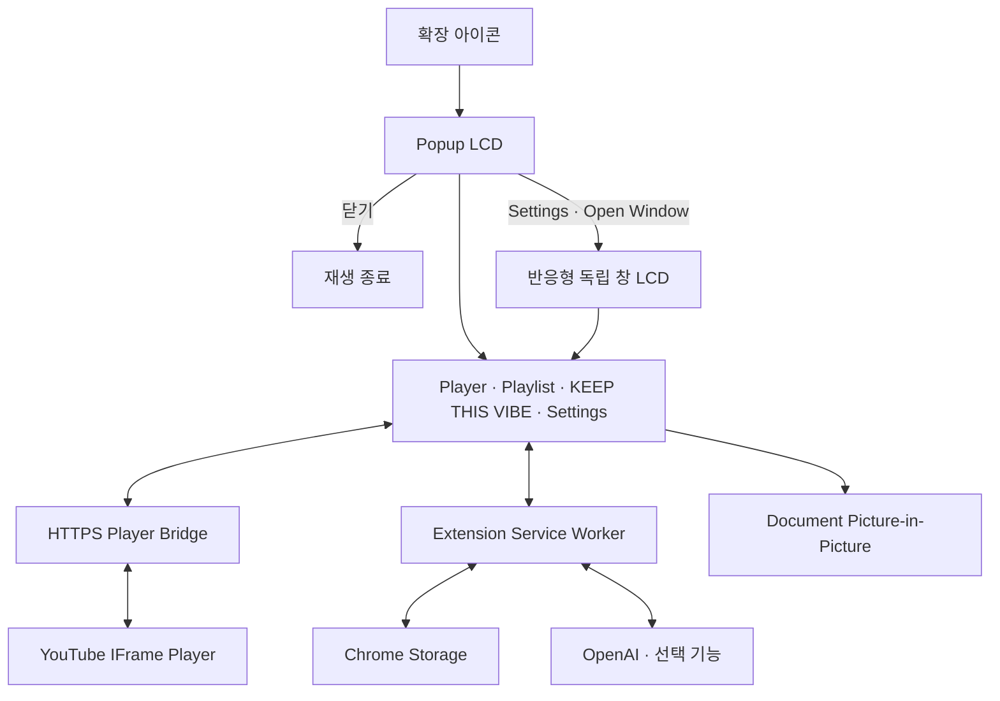

# Pixel Jukebox

> 현재 곡의 분위기를 이어갈 Playlist를 AI가 큐레이션하고, 실제 YouTube 영상까지 검증해 재생하는 Game Boy 스타일 Chrome Extension

<p align="center">
  
  
  
</p>

## 프로젝트 개요

Pixel Jukebox는 Chrome Desktop에서 동작하는 Manifest V3 확장 프로그램이다. Core Player는 OpenAI 없이 사용할 수 있으며, `KEEP THIS VIBE`를 실행할 때만 사용자의 OpenAI API Key로 현재 곡의 흐름을 이어갈 Playlist를 탐색한다.

## 주요 기능

### Core Player

- HTTPS Player Bridge 기반 YouTube 재생
- Playlist 추가·삭제·순서 변경과 이전·다음·반복 재생
- 음량·음소거, 광고 자동 건너뛰기, 사용자 설정 복구
- D-pad, A/B, SELECT/START와 키보드 조작
- Popup, 반응형 독립 창, Document Picture-in-Picture
- 본체·LCD·버튼 색상 설정

### KEEP THIS VIBE

- 현재 곡을 중심으로 분위기·시대감·질감·감정선이 이어지는 후보 탐색
- Discovery 20–30곡에서 Selection 12–20곡을 구성
- OpenAI Web Search와 Structured Outputs 기반 큐레이션
- 실제 YouTube 출처와 oEmbed Metadata로 곡·Artist 일치 여부 검증
- 검증된 결과만 추천 순서대로 표시하고 Playlist에 바로 추가
- Cache와 중복 요청 병합, `MORE LIKE THIS` 재탐색, 실패 시 부분 결과 유지

## 전체 구조



## 기술 구성

| 영역 | 기술 |
| --- | --- |
| Extension | Chrome Extension Manifest V3 · Chrome 140 이상 |
| Language | TypeScript |
| UI | HTML · CSS · TypeScript |
| Build · Test | Vite · Vitest |
| Player | GitHub Pages · YouTube IFrame Player API |
| Storage | `chrome.storage.local` · `chrome.storage.session` |
| AI | OpenAI Responses API · Web Search · Structured Outputs |

## 설치 및 실행

Node.js 22.12 이상이 필요하다.

### 1. HTTPS Player Bridge 배포

각 사용자는 저장소를 Fork하고 자기 GitHub Pages에 `player-bridge/`를 배포한다.

1. GitHub 저장소의 **Settings → Pages → Source**에서 **GitHub Actions**를 선택한다.
2. **Actions → Deploy player bridge → Run workflow**를 실행한다.
3. `bridge.config.example.json`을 `bridge.config.local.json`으로 복사한다.
4. 복사한 파일에 자기 Bridge 주소를 입력한다.

```json
{
  "url": "https://YOUR_USERNAME.github.io/YOUR_REPOSITORY/player.html"
}
```

빌드 시 이 주소가 Player URL, CSP와 프레임 검증 설정에 함께 반영된다. 설정이 없거나 올바른 HTTPS 페이지 주소가 아니면 빌드가 중단된다. `bridge.config.local.json`은 Git에 포함되지 않는다.

공유된 소스를 사용하는 사람도 자기 Bridge를 배포하고 설정한 뒤 빌드해야 한다. `dist/`에는 빌드한 사람의 Bridge 주소가 포함된다. 제출 검토자는 위에 제공된 Player Bridge URL을 그대로 사용하면 되며, 별도 Fork나 Bridge 배포는 필요하지 않다.

### 2. Extension 빌드

```sh
npm ci
npm run build
```

1. `chrome://extensions`에서 **개발자 모드**를 활성화한다.
2. **압축해제된 확장 프로그램을 로드합니다**를 선택한다.
3. 빌드된 `dist/` 디렉터리를 연다.
4. Pixel Jukebox 아이콘을 눌러 Popup을 실행한다.

코드를 변경한 뒤에는 다시 빌드하고 확장을 새로고침한다.

### 제출용 최소 실행 경로

현재 확인된 제출 방식은 Repository를 내려받아 빌드한 뒤 `dist/`를 Load unpacked 하는 방식이다. GitHub Release ZIP은 아직 생성되지 않았다.

1. [Pixel Jukebox Repository](https://github.com/seoheejung/pixel-jukebox)를 내려받고 Node.js 22.12 이상을 준비한다.
2. `npm ci`를 실행한다.
3. 저장소 루트에서 `bridge.config.example.json`을 `bridge.config.local.json`으로 복사한다.

```sh
cp bridge.config.example.json bridge.config.local.json
```

PowerShell에서는 `Copy-Item bridge.config.example.json bridge.config.local.json`을 사용한다. 생성한 파일의 `url`에 제출자가 제공한 [Player Bridge](https://seoheejung.github.io/pixel-jukebox/player.html) URL을 입력한다.
4. `npm run build`를 실행한다.
5. Chrome `chrome://extensions`에서 개발자 모드를 켜고 `dist/`를 **압축해제된 확장 프로그램을 로드합니다**로 선택한다.
6. Extension을 열고 Settings에서 OpenAI API Key를 입력한 뒤 `CONNECT`를 누른다.

`bridge.config.local.json`은 빌드 전 필수인 로컬 설정이며 Git에 포함하지 않는다. Release ZIP과 별도 설치 링크는 현재 미확정이다.

### 3. KEEP THIS VIBE 설정

Settings의 OpenAI 화면에서 `CONNECT`를 눌러 필요한 host 권한을 승인하고 API Key를 등록한다. 현재 UI에서 Key는 `chrome.storage.session`에만 저장되며 Chrome 세션이 끝나면 제거된다.

API Key 조회와 OpenAI 호출은 Service Worker에서만 처리한다. Key를 소스, Git, 로그, Runtime 메시지 또는 Player 프레임에 포함하지 않는다.

## 검증

```sh
npm run typecheck
npm test
npm run check:bridge
npm run check:manifest
```

빌드 후 Chrome fixture를 실행할 수 있다.

```sh
npm run test:chrome:bridge
npm run test:chrome:ui
npm run test:chrome:audio
npm run test:chrome:audio:popup
```

실제 OpenAI E2E, 추천 품질, Usage·비용 측정은 [측정 절차](docs/results/openai-e2e-runbook.md)를 따른다. API Key는 열린 Extension UI에 사용자가 직접 입력하며 측정 스크립트나 결과 파일에 전달하지 않는다.

실제 Bridge 재생은 `npm run chrome:start`로 연 테스트 프로필에서 확인하고, 검증 후 `npm run chrome:stop`으로 종료한다. Auto Skip Ads는 실제 광고에서 동작을 확인했다. 실제 OpenAI E2E·추천 품질·Usage 측정 결과는 `docs/results/openai-e2e-*.md`에 기록하며, Document PiP 창 생성은 최종 제출 환경에서 별도로 확인한다.

## 제출 요약

- 한 줄 설명: 현재 곡의 분위기를 이어갈 Playlist를 AI가 큐레이션하고 YouTube 영상까지 검증하는 Game Boy 스타일 Chrome Extension
- 해결하려는 문제: 장르·유사도만 나열하지 않고 지금 듣는 곡 다음에 자연스럽게 이어질 음악을 찾는 문제
- AI 활용: OpenAI Responses API와 Web Search로 후보를 조사하고, Structured Outputs로 Selection을 고정한 뒤 YouTube oEmbed로 실제 영상을 재검증한다.
- 사용 AI Tool: OpenAI Responses API, Web Search, Structured Outputs
- 대표 화면: 현재 저장소에서 제출용 대표 이미지는 [YouTube 재생 화면](docs/images/Screenshot%202026-09-14%20202236.png)으로 선정했다. Game Boy 본체, 실제 YouTube 영상, 재생 컨트롤이 한 화면에 보인다. KEEP THIS VIBE 결과 화면은 실제 실행 시 캡처해 교체할 수 있다.

### Known Limitations

- 최종 추천 수가 내부 목표 12곡에 미달할 수 있다.
- Resolver / video verification 처리 시간이 길 수 있다.
- E2E runner와 실제 UI 완료 상태의 동기화 문제가 남아 있다.

실제 OpenAI E2E 성공 보고서는 `docs/results/openai-e2e-*.md`에 보존하며, 실패·timeout 실행은 성공 근거로 사용하지 않는다. 제출 시에는 `dist/`를 압축해 Chrome의 **압축해제된 확장 프로그램을 로드합니다**로 실행하고, 위에 제공된 Player Bridge URL을 사용한다. 자기 GitHub Pages Bridge는 Fork로 재배포할 때만 필요하다.
