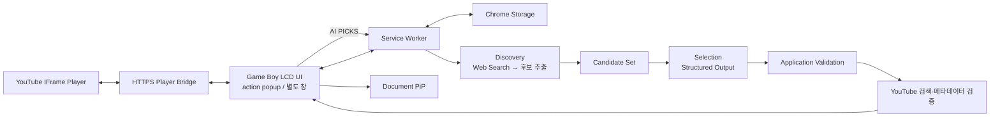

# Pixel Jukebox

> Game Boy LCD 메뉴 기반 YouTube Player, Playlist 관리, 지금의 분위기를 잇는 `이어 듣기`를 제공하는 Chrome Extension
> 

## 프로젝트 개요

Chrome Desktop 환경의 YouTube 음악 감상 경험 확장

### Core Player

- OpenAI 없이 독립 동작
- HTTPS Player Bridge 기반 YouTube 재생 상태 연동
- Game Boy 본체와 LCD 메뉴 기반 음악 Player
- Playlist 관리
- 사용자 설정 저장 및 복구
- LCD 테마 버튼·입력창·스크롤바와 전용 픽셀 아이콘

### 이어 듣기

- 사용자 선택 기반 활성화
- 사용자 OpenAI API Key 사용
- 현재 Track의 분위기와 Playlist 재생 순서를 이어갈 음악 탐색
- Web Search 기반 후보 탐색
- Candidate Set 기반 최종 추천
- AI 미사용 시 OpenAI API 요청 없음

### 현재 상태

- Game Boy LCD 화면 통합, action popup과 별도 창, Playlist·Appearance·Document PiP 구현
- 현재 곡 유사도 추천, 후보 재검색, YouTube 검증과 부분 결과 처리 구현
- 요청 기준 곡·진행 단계·Retry·픽셀 로딩 표시, 모션 감소 설정 대응
- 2026-09-12 최신 검증: 테스트 7개 파일·57개, 타입 검사·빌드·manifest·Chrome fixture 통과
- 로컬 Chrome fixture 통과: 360/390/480px 메뉴, 슬라이딩 목록, 연결 후 AI Picks 이동, LP 검색·진행·Retry, 380×650/720×940 창 확대
- 실제 OpenAI·YouTube 호출과 추천 품질, 실제 Document PiP 창 생성은 미검증

과거 Phase 검증과 최신 변경 검증을 구분한다. 상세 결과는 [LCD 화면 리디자인](docs/results/gameboy-screen-redesign.md)과 [추천·실패 처리](docs/results/ai-similarity-diagnostics.md)에 기록한다.

---

## 주요 기능

### Core Player

- YouTube URL 입력 및 HTTPS Player Bridge 재생
- LCD 내부 Now Playing · Playlist · Add Music · 이어 듣기 · Settings 화면
- Playlist 추가·삭제·순서 변경
- 이전·다음 Track 및 반복 재생
- 색상 및 Disc Style 설정
- 새 YouTube 탭 없는 Bridge Player
- Document Picture-in-Picture
- Playlist 및 사용자 설정 복구
- D-pad · A/B · SELECT/START와 키보드 조작
- Playlist 방향키는 제목만 이동, 삭제 버튼은 클릭·Tab으로 접근
- Now Playing의 QUEUE 버튼으로 재생을 유지하는 하단 슬라이딩 목록 열기·닫기
- 메뉴 진입 시 일시정지, Now Playing 복귀 후 A로 재생
- Settings의 Open Window로 독립 창 열기

확장 아이콘은 360px 폭의 popup을 연다. popup을 닫으면 재생도 종료된다. Open Window는 380×650px 별도 창을 Home에서 열며, 현재 곡과 재생 위치는 이전하지 않는다.

Auto Skip Ads는 `debugger` 권한으로 자체 내장 YouTube 프레임의 활성 건너뛰기 버튼에 브라우저 입력을 전달한다. ON 상태이며 Now Playing이 표시될 때만 요청하고 입력 후 디버거를 해제한다. 연결 실패 시 Settings에 `ON · ERROR`가 표시된다. 이 변경을 적용하려면 확장을 새로고침하고 플레이어를 다시 열어야 한다. 실제 action popup의 Chrome fixture를 통과했으며, 2026-09-13 사용자가 실제 광고에서 자동 건너뛰기를 확인했다. [검증 결과](docs/results/volume-auto-skip.md) 참조.

별도 창은 기본 레이아웃을 최소 크기로 유지하면서 창 크기에 맞춰 본체와 LCD를 확장한다. Now Playing의 LP 버튼은 재생을 유지하면서 `이어 듣기` 패널을 아래에서 연다. 같은 기준 곡의 기존 결과는 다시 사용하고 새 검색은 ‘다시 추천’으로 실행한다. Playlist 슬라이드와 추천 슬라이드는 하나씩 열리며, B나 닫기로 내릴 수 있다. Mini Player는 Document PiP API를 지원하는 환경에서만 메뉴에 표시한다.

### 이어 듣기

- 사용자 OpenAI API Key 기반 선택 기능
- API Key 연결 완료 후 이어 듣기로 이동 (LP에서 시작했다면 슬라이드로 복귀)
- 현재 곡의 분위기·에너지·그루브를 유지하는 다음 곡 순서 추천
- Web Search 기반 Candidate 탐색
- Candidate Set 기반 최종 Selection
- Structured Output 검증
- 기준 곡 표시와 자연스럽게 이어지는 추천 순서
- 검증된 YouTube 추천을 Playlist에 직접 추가
- Recommendation Cache
- AI 오류와 Core Player 오류 격리
- 빈 후보 시 검색 범위를 완화한 1회 재검색
- 최대 15곡 후보에서 5–8곡을 목표로 보충 검색하고 영상 검증 후에도 선택 순서 유지
- 추가 YouTube 검색 실패 시 검증된 부분 결과 유지
- 같은 Panel의 동시 중복 요청 병합
- 요청 기준 곡·단계별 진행 상태·오류 후 Retry·픽셀 로딩 표시

> 이어 듣기 미사용 시 OpenAI API 요청 0건. 검증 가능한 곡이 5개 미만이면 확보한 곡과 안내를 먼저 표시한다.

---

## 전체 구조

```text
Extension UI (action popup / 별도 창)
→ HTTPS Player Bridge
→ YouTube IFrame Player
```



---

## 안정성과 오류 처리

- 추천 요청은 UI → Service Worker → 후보 탐색·선택 → YouTube 검증 → UI 순서로 처리한다. 재생 경로와 추천 오류를 분리한다.
- 후보가 비면 최근 추천 제외 조건을 완화해 한 번 더 탐색한다. 현재 곡·Playlist·정규화된 Artist/Title 중복 제외는 유지한다.
- 추가 검색이 실패해도 검증된 곡이 남으면 부분 결과를 반환한다. 최종 결과가 없으면 해당 단계의 오류를 표시한다.
- 같은 Panel에서 동시에 들어온 추천 요청을 병합한다. Cache Hit는 추천 API 호출을 생략하며 Refresh는 캐시를 우회한다.
- 연결 확인은 15초, 개별 Responses API 요청은 120초 제한을 적용한다. 전체 추천 작업의 총 제한 시간과는 다르다.
- 실패 단계·HTTP 상태·정제한 오류 정보를 전달하고 API Key와 인증 헤더는 노출하지 않는다.

빈 후보, 중복 제외, 보충 검색 실패 후 부분 결과 보존, 동시 요청 병합은 모의 응답으로 검증했다. 실제 외부 서비스 검증과 구분한 결과는 [추천·실패 처리 기록](docs/results/ai-similarity-diagnostics.md)을 따른다.

---

## 기술 구성

| 영역 | 기술 |
| --- | --- |
| Extension | Chrome Extension Manifest V3 |
| 최소 Chrome | Chrome 140 |
| Language | TypeScript |
| UI | HTML / CSS / TypeScript |
| Build | Vite |
| Main UI | Game Boy LCD · Chrome action popup / 별도 창 |
| Background | Extension Service Worker |
| Player Bridge | GitHub Pages · YouTube IFrame Player API |
| Storage | `chrome.storage.local`, `chrome.storage.session` |
| PiP | Document Picture-in-Picture |
| AI | OpenAI Responses API |
| AI 탐색 | OpenAI Web Search |
| AI 출력 | Structured Outputs / JSON Schema |
| Test | Vitest |

초기 범위 기준 UI Framework 미사용

---

## AI PICKS 구조

```
Current Track + Playlist + Recent Recommendations
        ↓
Discovery
Responses API + Web Search
        ↓
근거 텍스트 → Structured Output 후보 추출 → Candidate Parser
        ↓
Candidate Set
        ↓
Selection
Responses API / No Tools
        ↓
Structured Output
        ↓
Application Validation
        ↓
YouTube 검색 → 메타데이터 검증 → 부족한 결과 보충 검색
        ↓
AI PICKS
```

### 핵심 기준

- Web Search와 Strict Structured Output 요청 분리
- Discovery 단계의 Web Search 사용
- Selection 단계의 Tool 미사용
- Selection의 Candidate ID 기반 선택
- Artist / Track 신규 생성 차단
- Candidate Set 외 결과 차단
- Selection 실패 시 동일 Candidate Set 기반 1회 Retry
- Selection Retry는 Discovery를 재실행하지 않음
- Discovery 결과가 비면 최근 추천 제외를 완화해 별도로 1회 재검색
- 최종 YouTube 검증을 통과한 곡을 5–8곡 목표로 표시, 보충 검색 실패 시 부분 결과 유지
- 방송 채널과 실제 아티스트를 구분해 곡을 식별하고, 짧은 한글·영문 이름은 메타데이터 토큰으로 일치 여부 확인
- 모바일·음악 전용 YouTube 주소 및 live/embed 주소를 표준 영상 주소로 정규화하고, 직접 영상 출처가 없으면 곡별 집중 검색
- Partial JSON 자동 복구 없음

---

## 프로젝트 Phase

| Phase | 범위 | 상태 |
| --- | --- | --- |
| Phase 0 | Extension 기반 구성 | 구현·자동 검증 완료 · 로컬 Chrome UI fixture 통과 |
| Phase 1 | YouTube Player | 구현·자동 검증 완료 · 최신 Bridge 실제 재생 미검증 |
| Phase 2 | Playlist · Design · PiP | 구현·자동 검증 및 LCD Chrome fixture 통과 · 실제 PiP 창 생성 미검증 |
| Phase 3 | OpenAI 연결 | 구현·자동 검증 완료 · 실제 OpenAI 인증 미검증 |
| Phase 4 | AI Recommendation | 구현·자동 검증 완료 · 실제 OpenAI API/Web Search 미검증 |
| Phase 5 | Cache · 안정성 검증 | 구현·자동 검증 완료 · 실제 OpenAI 외부 환경 검증 필요 |

구현 완료와 외부 API 검증 완료의 분리 관리

최신 로컬 검증은 위의 현재 상태를 기준으로 하며, 과거 Phase 결과 문서의 실행 기록은 당시 결과로 보존한다.

---

## 문서 구조

```
pixel-jukebox/
├── .project/
│   └── plan.md
├── AGENTS.md
├── DESIGN.md
├── README.md
└── docs/
    ├── instructions/
    │   ├── phase0-extension-base.md
    │   ├── phase1-youtube-player.md
    │   ├── phase2-playlist-design-export-pip.md
    │   ├── phase3-openai-connection.md
    │   ├── phase4-ai-recommendation.md
    │   └── phase5-cache-stability.md
    └── results/
        ├── phase0-extension-foundation.md
        ├── phase1-youtube-player.md
        ├── phase2-playlist-design-export-pip.md
        ├── phase3-openai-connection.md
        ├── phase4-ai-recommendation.md
        └── phase5-cache-stability.md
```

### 문서 역할

최근 작업 기록:

- [이어 듣기: LP 슬라이드·분위기 연속성·5–8곡 검증](docs/results/continue-listening.md)
- [메뉴·슬라이딩 Playlist·YouTube 출처 후속 수정](docs/results/menu-playlist-search-followup.md)
- [스크린샷 후속: 창 확대·LP 바로가기·5곡 보충 검색](docs/results/screenshot-ui-recommendation-followup.md)
- [Game Boy LCD 화면·popup·별도 창](docs/results/gameboy-screen-redesign.md)
- [현재 곡 유사도·후보 재검색·부분 결과·실패 진단](docs/results/ai-similarity-diagnostics.md)
- [재질·모션·Document PiP 구현](docs/results/gameboy-material-motion-pip.md)
- [UI 상태와 Playlist 연결 후속 작업](docs/results/gameboy-ui-followup.md)

| 문서 | 역할 |
| --- | --- |
| `.project/plan.md` | 전체 기능 및 Phase 범위 기준 |
| `AGENTS.md` | 작업 규칙, 범위 제한, 검증 기준 |
| `DESIGN.md` | Pixel UI, Layout, Color, Component 기준 |
| `docs/instructions/phaseN-*.md` | Phase별 구현·검증 지침 |
| `docs/results/phaseN-*.md` | 실제 구현·실행·검증 결과 |
| `README.md` | 프로젝트 개요, 실행 방법, 현재 상태 |

---

## OpenAI API Key 정책

### 기본 저장

`chrome.storage.session` 기반 세션 저장

### 선택적 영속 저장

- 사용자 명시적 선택
- `chrome.storage.local` 사용
- `TRUSTED_CONTEXTS` 접근 제한 적용
- Service Worker Local Key 조회 성공 확인
- 비신뢰 Context의 Local·Session Key 조회 차단
- 접근 제한 설정 실패 시 Local 저장 차단
- Session 저장 유지

### 보안 기준

- Source Code API Key 포함 금지
- Git Commit 금지
- `storage.sync` 저장 금지
- Runtime Message Key 포함 금지
- Embedded Player Key 전달 금지
- Console·오류 로그 Key 출력 금지

### 배포 범위

현재 BYOK 구조의 개인 개발·학습·포트폴리오 범위 한정

일반 사용자 대상 공개 서비스 전환 시 별도 검토 대상:

- Backend Proxy
- 사용자 인증
- Server Secret 관리
- Rate Limit
- Abuse 방지
- 사용량·비용 정책

---

## 실행

### 기본 검증

Node 22.12 이상 기준

```
npm install
npm run build
npm run typecheck
npm test
npm run check:bridge
npm run check:manifest
```

### HTTPS Player Bridge 배포

Bridge는 `player-bridge/`의 정적 파일만 GitHub Pages에 배포한다. GitHub 저장소의 **Settings → Pages → Source**를 **GitHub Actions**로 한 번 설정한 뒤 `Deploy player bridge` workflow를 실행한다.

기본 배포 URL:

```text
https://seoheejung.github.io/pixel-jukebox/player.html
```

Fork 또는 별도 도메인을 사용하면 `src/shared/player-bridge.ts`의 URL과 `public/manifest.json`의 `frame-src` origin을 함께 변경한다.

### Chrome Extension 실행

1. 의존성 설치 및 빌드

```sh
npm install
npm run build

```
`chrome://extensions` 접속
→ **개발자 모드** 활성화
→ **압축해제된 확장 프로그램** 로드
→ `dist/` 선택
→ Extension 아이콘 클릭
→ Game Boy popup 실행

### 실제 Chrome 검증

```
npm run chrome:start
```

- Windows 설치 Chrome 기반 전용 테스트 프로필 사용
- `.chrome-test/` 테스트 프로필 저장
- 현재 실행 환경의 Chrome 시작 시 샌드박스 외부 실행 필요
- 배포된 Bridge URL 응답, 영상 재생, Play/Pause, Previous/Next를 수동 확인
- 검증 종료 후 `npm run chrome:stop`

---

## OpenAI AI PICKS 실제 검증

Phase 3~5 OpenAI 연동 구현 및 모의 응답 기반 자동 검증 완료

유효한 OpenAI API Key 기반 실제 인증·Responses API·Web Search 호출 검증 미완료

### 검증 준비

- OpenAI API 사용 가능한 개인 API Key
- OpenAI API 사용 가능 Project 및 결제·사용 한도
- Chrome 140 이상
- 빌드 완료 `dist/`

### 검증 순서

```
YouTube 음악 재생
        ↓
AI 기능 활성화
        ↓
OpenAI Host Permission 승인
        ↓
API Key 입력
        ↓
연결 확인
        ↓
AI PICKS 실행
```

### 확인 대상

- OpenAI 인증 성공
- Discovery Responses API 호출
- Web Search 실행
- Candidate Set 생성
- Selection Structured Output 성공
- Candidate ID Whitelist 통과
- 최대 5개 추천 표시
- 한국어 추천 이유 및 Music Tag 표시
- 추천 카드의 Playlist 직접 추가 및 Bridge 재생
- API Key 로그·메시지 노출 없음

> 실제 외부 API 호출 완료 전까지 OpenAI 연동의 실제 검증 완료 처리 금지
