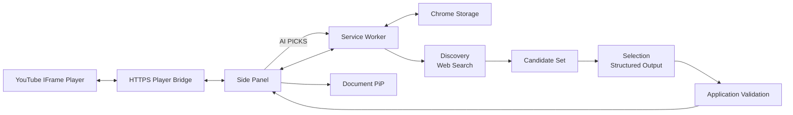

# Pixel Jukebox

> YouTube 재생 음악의 LP/CD 시각화, Playlist 관리, 선택적 OpenAI 기반 `AI PICKS`를 제공하는 Chrome Extension
> 

## 프로젝트 개요

Chrome Desktop 환경의 YouTube 음악 감상 경험 확장

### Core Player

- OpenAI 없이 독립 동작
- HTTPS Player Bridge 기반 YouTube 재생 상태 연동
- LP/CD 기반 음악 Player
- Playlist 관리
- 사용자 설정 저장 및 복구

### AI PICKS

- 사용자 선택 기반 활성화
- 사용자 OpenAI API Key 사용
- 현재 Track + Playlist 문맥 기반 음악 탐색
- Web Search 기반 후보 탐색
- Candidate Set 기반 최종 추천
- AI 미사용 시 OpenAI API 요청 없음

### 현재 상태

- Phase 0 Extension 기반 구성 구현·자동/Chrome 검증 완료
- Phase 1 YouTube Player Bridge 구현·자동 검증 완료 · Pages 배포/Chrome 검증 미완료
- Phase 2 Playlist · Design · PiP 구현·자동 검증 완료
- Phase 3 OpenAI 연결 구현·자동/Chrome 검증 완료
- Phase 4 AI Recommendation 구현·자동 검증 완료
- Phase 5 Cache · 안정성 구현·자동 검증 완료
- 실제 OpenAI 인증·Responses API·Web Search 외부 호출 검증 미완료

---

## 주요 기능

### Core Player

- YouTube URL 입력 및 HTTPS Player Bridge 재생
- LP/CD 회전 Player
- Playlist 추가·삭제·순서 변경
- 이전·다음 Track 및 반복 재생
- 색상 및 Disc Style 설정
- 새 YouTube 탭 없는 Bridge Player
- Document Picture-in-Picture
- Playlist 및 사용자 설정 복구

### AI PICKS

- 사용자 OpenAI API Key 기반 선택 기능
- 현재 Track + Playlist 문맥 기반 추천
- Web Search 기반 Candidate 탐색
- Candidate Set 기반 최종 Selection
- Structured Output 검증
- 추천 이유 및 Music Tag
- 검증된 YouTube 추천을 Playlist에 직접 추가
- Recommendation Cache
- AI 오류와 Core Player 오류 격리

> AI PICKS 미사용 시 OpenAI API 요청 0건

---

## 전체 구조

```text
Side Panel
→ HTTPS Player Bridge
→ YouTube IFrame Player
```



---

## 기술 구성

| 영역 | 기술 |
| --- | --- |
| Extension | Chrome Extension Manifest V3 |
| 최소 Chrome | Chrome 140 |
| Language | TypeScript |
| UI | HTML / CSS / TypeScript |
| Build | Vite |
| Main UI | Chrome Side Panel |
| Background | Extension Service Worker |
| Player Bridge | GitHub Pages · YouTube IFrame Player API |
| Storage | `chrome.storage.local`, `chrome.storage.session` |
| PiP | Document Picture-in-Picture |
| AI | OpenAI Responses API |
| AI 탐색 | OpenAI Web Search |
| AI 출력 | Structured Outputs / JSON Schema |
| Test | Vitest |

초기 범위 기준 UI Framework 미사용

---

## AI PICKS 구조

```
Current Track + Playlist + Recent Recommendations
        ↓
Discovery
Responses API + Web Search
        ↓
Candidate Parser
        ↓
Candidate Set
        ↓
Selection
Responses API / No Tools
        ↓
Structured Output
        ↓
Application Validation
        ↓
AI PICKS
```

### 핵심 기준

- Web Search와 Strict Structured Output 요청 분리
- Discovery 단계의 Web Search 사용
- Selection 단계의 Tool 미사용
- Selection의 Candidate ID 기반 선택
- Artist / Track 신규 생성 차단
- Candidate Set 외 결과 차단
- Selection 실패 시 동일 Candidate Set 기반 1회 Retry
- Retry 시 Discovery 재실행 없음
- Partial JSON 자동 복구 없음

---

## 프로젝트 Phase

| Phase | 범위 | 상태 |
| --- | --- | --- |
| Phase 0 | Extension 기반 구성 | 구현·자동/Chrome 검증 완료 |
| Phase 1 | YouTube Player | 구현·자동/Chrome 검증 완료 |
| Phase 2 | Playlist · Design · PiP | 구현·자동 검증 완료 |
| Phase 3 | OpenAI 연결 | 구현·자동/Chrome 검증 완료 · 실제 OpenAI 인증 미검증 |
| Phase 4 | AI Recommendation | 구현·자동 검증 완료 · 실제 OpenAI API/Web Search 미검증 |
| Phase 5 | Cache · 안정성 검증 | 구현·자동 검증 완료 · 실제 OpenAI 외부 환경 검증 필요 |

구현 완료와 외부 API 검증 완료의 분리 관리

---

## 문서 구조

```
pixel-jukebox/
├── .project/
│   └── plan.md
├── AGENT.md
├── DESIGN.md
├── README.md
└── docs/
    ├── instructions/
    │   ├── phase0-extension-base.md
    │   ├── phase1-youtube-player.md
    │   ├── phase2-playlist-design-export-pip.md
    │   ├── phase3-openai-connection.md
    │   ├── phase4-ai-recommendation.md
    │   └── phase5-cache-stability.md
    └── results/
        ├── phase0-extension-foundation.md
        ├── phase1-youtube-player.md
        ├── phase2-playlist-design-export-pip.md
        ├── phase3-openai-connection.md
        ├── phase4-ai-recommendation.md
        └── phase5-cache-stability.md
```

### 문서 역할

| 문서 | 역할 |
| --- | --- |
| `.project/plan.md` | 전체 기능 및 Phase 범위 기준 |
| `AGENT.md` | 작업 규칙, 범위 제한, 검증 기준 |
| `DESIGN.md` | Pixel UI, Layout, Color, Component 기준 |
| `docs/instructions/phaseN-*.md` | Phase별 구현·검증 지침 |
| `docs/results/phaseN-*.md` | 실제 구현·실행·검증 결과 |
| `README.md` | 프로젝트 개요, 실행 방법, 현재 상태 |

---

## OpenAI API Key 정책

### 기본 저장

`chrome.storage.session` 기반 세션 저장

### 선택적 영속 저장

- 사용자 명시적 선택
- `chrome.storage.local` 사용
- `TRUSTED_CONTEXTS` 접근 제한 적용
- Service Worker Local Key 조회 성공 확인
- Side Panel 외부 Context Local·Session Key 조회 차단 확인
- 접근 제한 설정 실패 시 Local 저장 차단
- Session 저장 유지

### 보안 기준

- Source Code API Key 포함 금지
- Git Commit 금지
- `storage.sync` 저장 금지
- Runtime Message Key 포함 금지
- Embedded Player Key 전달 금지
- Console·오류 로그 Key 출력 금지

### 배포 범위

현재 BYOK 구조의 개인 개발·학습·포트폴리오 범위 한정

일반 사용자 대상 공개 서비스 전환 시 별도 검토 대상:

- Backend Proxy
- 사용자 인증
- Server Secret 관리
- Rate Limit
- Abuse 방지
- 사용량·비용 정책

---

## 실행

### 기본 검증

Node 22.12 이상 기준

```
npm install
npm run build
npm run typecheck
npm test
npm run check:bridge
npm run check:manifest
```

### HTTPS Player Bridge 배포

Bridge는 `player-bridge/`의 정적 파일만 GitHub Pages에 배포한다. GitHub 저장소의 **Settings → Pages → Source**를 **GitHub Actions**로 한 번 설정한 뒤 `Deploy player bridge` workflow를 실행한다.

기본 배포 URL:

```text
https://seoheejung.github.io/pixel-jukebox/player.html
```

Fork 또는 별도 도메인을 사용하면 `src/shared/player-bridge.ts`의 URL과 `public/manifest.json`의 `frame-src` origin을 함께 변경한다.

### Chrome Extension 실행

1. 의존성 설치 및 빌드

```sh
npm install
npm run build

```
`chrome://extensions` 접속
→ **개발자 모드** 활성화
→ **압축해제된 확장 프로그램** 로드
→ `dist/` 선택
→ Extension 아이콘 클릭
→ Side Panel 실행

### 실제 Chrome 검증

```
npm run chrome:start
```

- Windows 설치 Chrome 기반 전용 테스트 프로필 사용
- `.chrome-test/` 테스트 프로필 저장
- 현재 실행 환경의 Chrome 시작 시 샌드박스 외부 실행 필요
- 배포된 Bridge URL 응답, 영상 재생, Play/Pause, Previous/Next를 수동 확인
- 검증 종료 후 `npm run chrome:stop`

---

## OpenAI AI PICKS 실제 검증

Phase 3~5 OpenAI 연동 구현 및 자동 검증 완료

유효한 OpenAI API Key 기반 실제 인증·Responses API·Web Search 호출 검증 미완료

### 검증 준비

- OpenAI API 사용 가능한 개인 API Key
- OpenAI API 사용 가능 Project 및 결제·사용 한도
- Chrome 140 이상
- 빌드 완료 `dist/`

### 검증 순서

```
YouTube 음악 재생
        ↓
AI 기능 활성화
        ↓
OpenAI Host Permission 승인
        ↓
API Key 입력
        ↓
연결 확인
        ↓
AI PICKS 실행
```

### 확인 대상

- OpenAI 인증 성공
- Discovery Responses API 호출
- Web Search 실행
- Candidate Set 생성
- Selection Structured Output 성공
- Candidate ID Whitelist 통과
- 최대 5개 추천 표시
- 한국어 추천 이유 및 Music Tag 표시
- 추천 카드의 Playlist 직접 추가 및 Bridge 재생
- API Key 로그·메시지 노출 없음

> 실제 외부 API 호출 완료 전까지 OpenAI 연동의 실제 검증 완료 처리 금지
