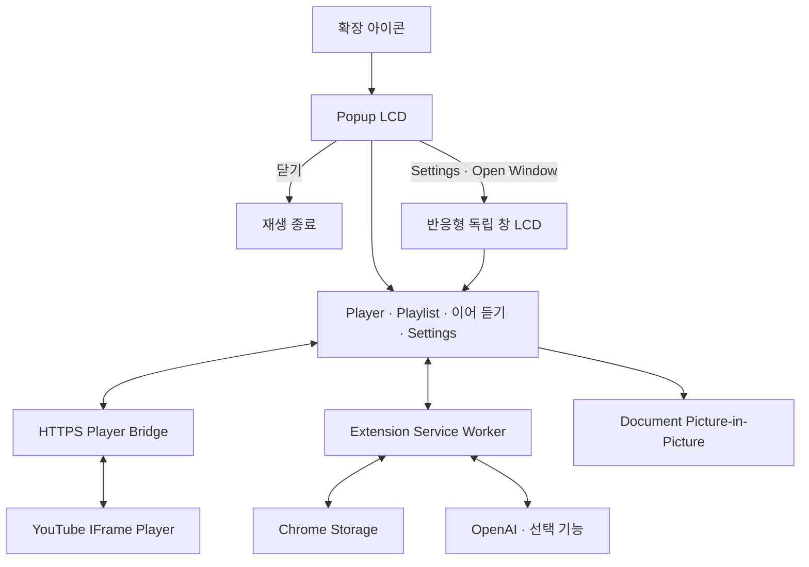

# Pixel Jukebox

> Game Boy LCD 메뉴로 YouTube 재생, Playlist 관리, 현재 분위기를 잇는 음악 추천을 제공하는 Chrome Extension

<p align="center">
  
  
  
</p>

## 프로젝트 개요

Pixel Jukebox는 Chrome Desktop에서 동작하는 Manifest V3 확장 프로그램이다. Core Player는 OpenAI 없이 사용할 수 있으며, `이어 듣기`를 활성화한 경우에만 사용자의 OpenAI API Key로 다음 곡을 탐색한다.

## 주요 기능

### Core Player

- HTTPS Player Bridge 기반 YouTube 재생
- Playlist 추가·삭제·순서 변경과 이전·다음·반복 재생
- 음량·음소거, 광고 자동 건너뛰기, 사용자 설정 복구
- D-pad, A/B, SELECT/START와 키보드 조작
- Popup, 반응형 독립 창, Document Picture-in-Picture
- 본체·LCD·버튼 색상 설정

### 이어 듣기

- 현재 곡과 Playlist 흐름을 기준으로 후보 탐색
- OpenAI Web Search와 Structured Outputs 기반 추천
- YouTube 영상과 곡 일치 여부 검증
- 검증된 결과를 최대 12곡까지 추천 순서대로 표시하고 Playlist에 추가
- Cache, 중복 요청 병합, 실패 시 부분 결과 유지

## 전체 구조



## 기술 구성

| 영역 | 기술 |
| --- | --- |
| Extension | Chrome Extension Manifest V3 · Chrome 140 이상 |
| Language | TypeScript |
| UI | HTML · CSS · TypeScript |
| Build · Test | Vite · Vitest |
| Player | GitHub Pages · YouTube IFrame Player API |
| Storage | `chrome.storage.local` · `chrome.storage.session` |
| AI | OpenAI Responses API · Web Search · Structured Outputs |

## 설치 및 실행

Node.js 22.12 이상이 필요하다.

### 1. HTTPS Player Bridge 배포

각 사용자는 저장소를 Fork하고 자기 GitHub Pages에 `player-bridge/`를 배포한다.

1. GitHub 저장소의 **Settings → Pages → Source**에서 **GitHub Actions**를 선택한다.
2. **Actions → Deploy player bridge → Run workflow**를 실행한다.
3. `bridge.config.example.json`을 `bridge.config.local.json`으로 복사한다.
4. 복사한 파일에 자기 Bridge 주소를 입력한다.

```json
{
  "url": "https://YOUR_USERNAME.github.io/YOUR_REPOSITORY/player.html"
}
```

빌드 시 이 주소가 Player URL, CSP와 프레임 검증 설정에 함께 반영된다. 설정이 없거나 올바른 HTTPS 페이지 주소가 아니면 빌드가 중단된다. `bridge.config.local.json`은 Git에 포함되지 않는다.

공유된 소스를 사용하는 사람도 자기 Bridge를 배포하고 설정한 뒤 빌드해야 한다. `dist/`에는 빌드한 사람의 Bridge 주소가 포함된다.

### 2. Extension 빌드

```sh
npm install
npm run build
```

1. `chrome://extensions`에서 **개발자 모드**를 활성화한다.
2. **압축해제된 확장 프로그램을 로드합니다**를 선택한다.
3. 빌드된 `dist/` 디렉터리를 연다.
4. Pixel Jukebox 아이콘을 눌러 Popup을 실행한다.

코드를 변경한 뒤에는 다시 빌드하고 확장을 새로고침한다.

### 3. 이어 듣기 설정

Settings에서 AI 기능을 활성화하고 OpenAI host 권한과 API Key를 등록한다. Key는 기본적으로 `chrome.storage.session`에 저장하며, 사용자가 선택한 경우에만 제한된 `chrome.storage.local` 저장을 사용한다.

API Key 조회와 OpenAI 호출은 Service Worker에서만 처리한다. Key를 소스, Git, 로그, Runtime 메시지 또는 Player 프레임에 포함하지 않는다.

## 검증

```sh
npm run typecheck
npm test
npm run check:bridge
npm run check:manifest
```

빌드 후 Chrome fixture를 실행할 수 있다.

```sh
npm run test:chrome:bridge
npm run test:chrome:ui
npm run test:chrome:audio
npm run test:chrome:audio:popup
```

실제 Bridge 재생은 `npm run chrome:start`로 연 테스트 프로필에서 확인하고, 검증 후 `npm run chrome:stop`으로 종료한다. 실제 OpenAI 요청, Document PiP 창 생성과 광고 자동 건너뛰기는 각 외부 환경에서 별도로 확인한다.
